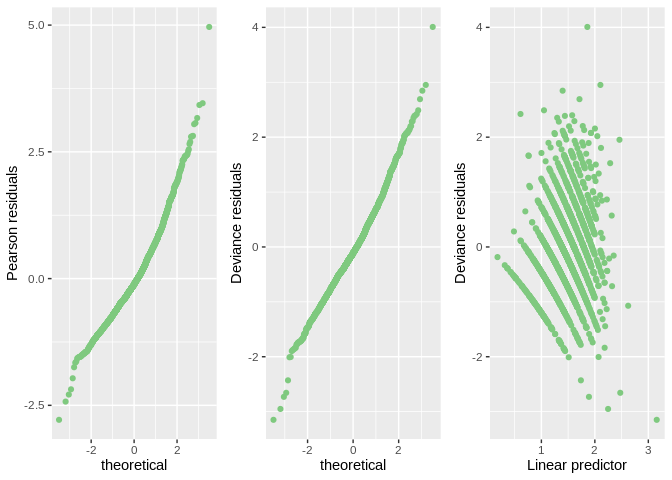
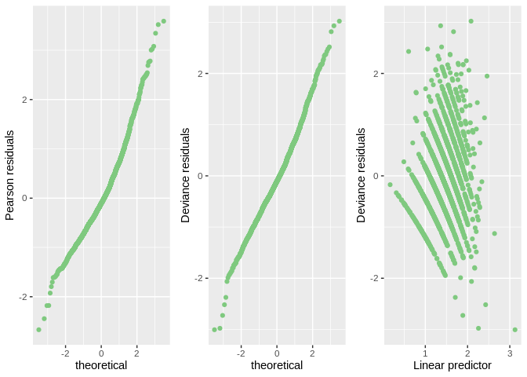
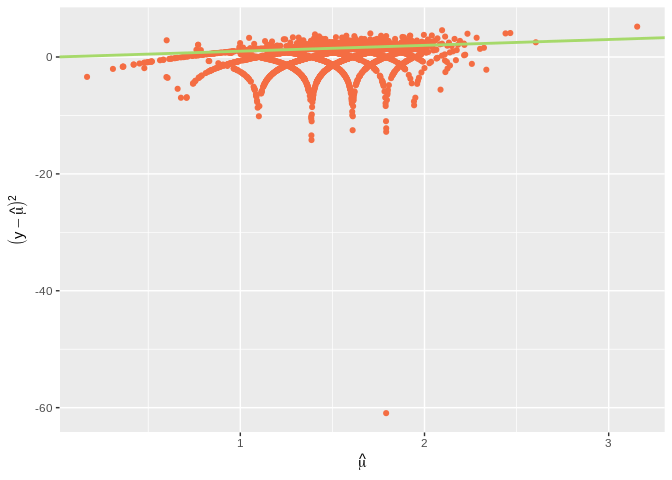

Group\_04
================
Suraj Kumar
17/07/2021

# Introduction

The Philippine government conducts surveys on household income and
expenditure every three years to understand the living conditions of
residents. In some past studies, we found that some factors may affect
the number of family members. This research studied 2122 families in
Soccsksargen district and collected the data of total household income,
total food expenditure, household head sex, household head age, type of
household, total number of family members, house floor area, house age,
number of bedrooms and electricity, the purpose is to find the
relationship between the number of family members and other variables.
This report focuses on a different analysis level through summaries,
boxplots, and general linear model. Section consists of an exploratory
data analysis of number of family members and explores the potential
relationship between member numbers and other variables. Section
contains the results from fitting a generalized linear model to the
data, as well as the assessment of the model assumptions. Concluding
remarks are given in Section .

# Exploratory Data Analysis

# Formal Data Analysis

We fit a Poisson model as our response is a count variable. We have
excluded Region as a covariate because there was only one factor. We
will start with a model that considers all the initial impressions from
the exploratory analysis. The model takes into account the interaction
between Household.Head.Age and Type.of.Household,
log(Total.Food.Expenditure ) and Type.of.Household,
log(Total.Household.Income) and Electricity, and Type.of.Household and
Electricity. We have scaled Total.Food.Expenditure,
Total.Household.Income, and House.Floor.Area by taking log
transformation to address the scalability issue in the design matrix.
Here is the summary of the described model:-

<table class="table table-striped table-hover table-condensed table-responsive" style="width: auto !important; margin-left: auto; margin-right: auto;">
<tbody>
<tr>
<td style="text-align:left;font-weight: bold;">
Observations
</td>
<td style="text-align:right;">
2122
</td>
</tr>
<tr>
<td style="text-align:left;font-weight: bold;">
Dependent variable
</td>
<td style="text-align:right;">
Total.Number.of.Family.members
</td>
</tr>
<tr>
<td style="text-align:left;font-weight: bold;">
Type
</td>
<td style="text-align:right;">
Generalized linear model
</td>
</tr>
<tr>
<td style="text-align:left;font-weight: bold;">
Family
</td>
<td style="text-align:right;">
poisson
</td>
</tr>
<tr>
<td style="text-align:left;font-weight: bold;">
Link
</td>
<td style="text-align:right;">
log
</td>
</tr>
</tbody>
</table>
<table class="table table-striped table-hover table-condensed table-responsive" style="width: auto !important; margin-left: auto; margin-right: auto;">
<tbody>
<tr>
<td style="text-align:left;font-weight: bold;">
𝛘²(19)
</td>
<td style="text-align:right;">
937.81
</td>
</tr>
<tr>
<td style="text-align:left;font-weight: bold;">
Pseudo-R² (Cragg-Uhler)
</td>
<td style="text-align:right;">
0.36
</td>
</tr>
<tr>
<td style="text-align:left;font-weight: bold;">
Pseudo-R² (McFadden)
</td>
<td style="text-align:right;">
0.10
</td>
</tr>
<tr>
<td style="text-align:left;font-weight: bold;">
AIC
</td>
<td style="text-align:right;">
8258.08
</td>
</tr>
<tr>
<td style="text-align:left;font-weight: bold;">
BIC
</td>
<td style="text-align:right;">
8371.29
</td>
</tr>
</tbody>
</table>
<table class="table table-striped table-hover table-condensed table-responsive" style="width: auto !important; margin-left: auto; margin-right: auto;border-bottom: 0;">
<thead>
<tr>
<th style="text-align:left;">
</th>
<th style="text-align:right;">
Est.
</th>
<th style="text-align:right;">
S.E.
</th>
<th style="text-align:right;">
z val.
</th>
<th style="text-align:right;">
p
</th>
</tr>
</thead>
<tbody>
<tr>
<td style="text-align:left;font-weight: bold;">
(Intercept)
</td>
<td style="text-align:right;">
-4.29
</td>
<td style="text-align:right;">
0.71
</td>
<td style="text-align:right;">
-6.00
</td>
<td style="text-align:right;">
0.00
</td>
</tr>
<tr>
<td style="text-align:left;font-weight: bold;">
Household.Head.SexMale
</td>
<td style="text-align:right;">
0.21
</td>
<td style="text-align:right;">
0.03
</td>
<td style="text-align:right;">
6.80
</td>
<td style="text-align:right;">
0.00
</td>
</tr>
<tr>
<td style="text-align:left;font-weight: bold;">
log(Household.Head.Age)
</td>
<td style="text-align:right;">
-0.02
</td>
<td style="text-align:right;">
0.07
</td>
<td style="text-align:right;">
-0.28
</td>
<td style="text-align:right;">
0.78
</td>
</tr>
<tr>
<td style="text-align:left;font-weight: bold;">
Type.of.HouseholdSingle Family
</td>
<td style="text-align:right;">
-0.68
</td>
<td style="text-align:right;">
0.57
</td>
<td style="text-align:right;">
-1.19
</td>
<td style="text-align:right;">
0.23
</td>
</tr>
<tr>
<td style="text-align:left;font-weight: bold;">
Type.of.HouseholdTwo or More Nonrelated Persons/Members
</td>
<td style="text-align:right;">
-11.18
</td>
<td style="text-align:right;">
12.66
</td>
<td style="text-align:right;">
-0.88
</td>
<td style="text-align:right;">
0.38
</td>
</tr>
<tr>
<td style="text-align:left;font-weight: bold;">
log(Total.Food.Expenditure)
</td>
<td style="text-align:right;">
0.54
</td>
<td style="text-align:right;">
0.06
</td>
<td style="text-align:right;">
9.86
</td>
<td style="text-align:right;">
0.00
</td>
</tr>
<tr>
<td style="text-align:left;font-weight: bold;">
log(Total.Household.Income)
</td>
<td style="text-align:right;">
0.01
</td>
<td style="text-align:right;">
0.06
</td>
<td style="text-align:right;">
0.19
</td>
<td style="text-align:right;">
0.85
</td>
</tr>
<tr>
<td style="text-align:left;font-weight: bold;">
Electricity1
</td>
<td style="text-align:right;">
2.06
</td>
<td style="text-align:right;">
0.58
</td>
<td style="text-align:right;">
3.53
</td>
<td style="text-align:right;">
0.00
</td>
</tr>
<tr>
<td style="text-align:left;font-weight: bold;">
log(House.Floor.Area)
</td>
<td style="text-align:right;">
-0.05
</td>
<td style="text-align:right;">
0.02
</td>
<td style="text-align:right;">
-2.80
</td>
<td style="text-align:right;">
0.01
</td>
</tr>
<tr>
<td style="text-align:left;font-weight: bold;">
Number.of.bedrooms
</td>
<td style="text-align:right;">
0.03
</td>
<td style="text-align:right;">
0.01
</td>
<td style="text-align:right;">
2.27
</td>
<td style="text-align:right;">
0.02
</td>
</tr>
<tr>
<td style="text-align:left;font-weight: bold;">
House.Age
</td>
<td style="text-align:right;">
-0.00
</td>
<td style="text-align:right;">
0.00
</td>
<td style="text-align:right;">
-3.96
</td>
<td style="text-align:right;">
0.00
</td>
</tr>
<tr>
<td style="text-align:left;font-weight: bold;">
log(Household.Head.Age):Type.of.HouseholdSingle Family
</td>
<td style="text-align:right;">
-0.08
</td>
<td style="text-align:right;">
0.08
</td>
<td style="text-align:right;">
-1.05
</td>
<td style="text-align:right;">
0.29
</td>
</tr>
<tr>
<td style="text-align:left;font-weight: bold;">
log(Household.Head.Age):Type.of.HouseholdTwo or More Nonrelated
Persons/Members
</td>
<td style="text-align:right;">
0.64
</td>
<td style="text-align:right;">
0.77
</td>
<td style="text-align:right;">
0.83
</td>
<td style="text-align:right;">
0.41
</td>
</tr>
<tr>
<td style="text-align:left;font-weight: bold;">
Type.of.HouseholdSingle Family:log(Total.Food.Expenditure)
</td>
<td style="text-align:right;">
0.04
</td>
<td style="text-align:right;">
0.06
</td>
<td style="text-align:right;">
0.62
</td>
<td style="text-align:right;">
0.53
</td>
</tr>
<tr>
<td style="text-align:left;font-weight: bold;">
Type.of.HouseholdTwo or More Nonrelated
Persons/Members:log(Total.Food.Expenditure)
</td>
<td style="text-align:right;">
0.88
</td>
<td style="text-align:right;">
1.39
</td>
<td style="text-align:right;">
0.63
</td>
<td style="text-align:right;">
0.53
</td>
</tr>
<tr>
<td style="text-align:left;font-weight: bold;">
Type.of.HouseholdSingle Family:log(Total.Household.Income)
</td>
<td style="text-align:right;">
0.04
</td>
<td style="text-align:right;">
0.05
</td>
<td style="text-align:right;">
0.82
</td>
<td style="text-align:right;">
0.41
</td>
</tr>
<tr>
<td style="text-align:left;font-weight: bold;">
Type.of.HouseholdTwo or More Nonrelated
Persons/Members:log(Total.Household.Income)
</td>
<td style="text-align:right;">
-0.01
</td>
<td style="text-align:right;">
0.79
</td>
<td style="text-align:right;">
-0.02
</td>
<td style="text-align:right;">
0.99
</td>
</tr>
<tr>
<td style="text-align:left;font-weight: bold;">
log(Total.Household.Income):Electricity1
</td>
<td style="text-align:right;">
-0.18
</td>
<td style="text-align:right;">
0.05
</td>
<td style="text-align:right;">
-3.59
</td>
<td style="text-align:right;">
0.00
</td>
</tr>
<tr>
<td style="text-align:left;font-weight: bold;">
Type.of.HouseholdSingle Family:Electricity1
</td>
<td style="text-align:right;">
-0.21
</td>
<td style="text-align:right;">
0.07
</td>
<td style="text-align:right;">
-3.03
</td>
<td style="text-align:right;">
0.00
</td>
</tr>
<tr>
<td style="text-align:left;font-weight: bold;">
Type.of.HouseholdTwo or More Nonrelated Persons/Members:Electricity1
</td>
<td style="text-align:right;">
-0.81
</td>
<td style="text-align:right;">
0.81
</td>
<td style="text-align:right;">
-0.99
</td>
<td style="text-align:right;">
0.32
</td>
</tr>
</tbody>
<tfoot>
<tr>
<td style="padding: 0; " colspan="100%">
 Standard errors: MLE
</td>
</tr>
</tfoot>
</table>

We can observe a lot of insignificant variables in our initial model.
However, before proceeding to the wald test to check the significance of
each variable, we, firstly, looked for any potential outliers and
checked whether assumptions are holding. We can notice that the deviance
of the model(1280.03) is much less than chi-square(2209.77). There could
be a case of underdispersion wherein the estimated variance is less than
the expected mean. We can interpret the coefficients in such a situation
but can’t rely on standard error as they are deflated.

Outlier check

We have plotted Normal\_qq\_plot for Pearson and deviance residuals. The
purpose of such plots is to identify any point that doesn’t follow the
straight line. We have also plotted deviance residuals vs. the fitted
value to check the independence and identify any pattern in the
residuals. From above Figure , we can notice one potential outlier at
the top of the qq\_plot, and presence of heavy tails. So, our next step
is to identify and remove the point and again fit the model. Let’s run
an Outlier test:-

    No Studentized residuals with Bonferroni p < 0.05
    Largest |rstudent|:
         rstudent unadjusted p-value Bonferroni p
    2033 4.047992         5.1659e-05      0.10957

We have identified the outlier point having id 2033. However, addressing
outlier is totally subjective. We try to fit the model again removing
this outlier and check for the assumptions.

Assumptions checking

From Figure , we can see some patterns in the residuals. It would be
better to fit some quadratic terms in the explanatory variables.
Residuals seem to be normally distributed with some heavy tails. Now, we
proceed with the dispersion test as there has been some evidence of
underdispersion.

Assumptions checking

        Underdispersion test

    data:  .
    z = -18.196, p-value < 2.2e-16
    alternative hypothesis: true alpha is less than 0
    sample estimates:
         alpha 
    -0.3865605 

The negative value of aplha (-0.39) is significant because the p\_value
for the hypothesis test is (0). Figure displays the underdispersed
variance. Therefore, we can’t rely on Wald’s test for inference in the
possion model. Rather, we perform analysis with quasi-poisson model that
adjusts variance for both overdispersion and underdispersion. We resort
to F test and do step by step variable removal to choose the best
fitting model.

<table class="table" style="margin-left: auto; margin-right: auto;">
<caption>
Performing F test on the inital model
</caption>
<thead>
<tr>
<th style="text-align:left;">
</th>
<th style="text-align:right;">
Df
</th>
<th style="text-align:right;">
Deviance
</th>
<th style="text-align:right;">
AIC
</th>
<th style="text-align:right;">
F value
</th>
<th style="text-align:right;">
Pr(&gt;F)
</th>
</tr>
</thead>
<tbody>
<tr>
<td style="text-align:left;">
&lt;none&gt;
</td>
<td style="text-align:right;">
NA
</td>
<td style="text-align:right;">
1263.642
</td>
<td style="text-align:right;">
8236.905
</td>
<td style="text-align:right;">
NA
</td>
<td style="text-align:right;">
NA
</td>
</tr>
<tr>
<td style="text-align:left;">
Household.Head.Sex
</td>
<td style="text-align:right;">
1
</td>
<td style="text-align:right;">
1316.352
</td>
<td style="text-align:right;">
8287.615
</td>
<td style="text-align:right;">
87.6384458
</td>
<td style="text-align:right;">
0.0000000
</td>
</tr>
<tr>
<td style="text-align:left;">
log(House.Floor.Area)
</td>
<td style="text-align:right;">
1
</td>
<td style="text-align:right;">
1271.718
</td>
<td style="text-align:right;">
8242.981
</td>
<td style="text-align:right;">
13.4283054
</td>
<td style="text-align:right;">
0.0002540
</td>
</tr>
<tr>
<td style="text-align:left;">
Number.of.bedrooms
</td>
<td style="text-align:right;">
1
</td>
<td style="text-align:right;">
1267.914
</td>
<td style="text-align:right;">
8239.177
</td>
<td style="text-align:right;">
7.1026865
</td>
<td style="text-align:right;">
0.0077558
</td>
</tr>
<tr>
<td style="text-align:left;">
House.Age
</td>
<td style="text-align:right;">
1
</td>
<td style="text-align:right;">
1277.668
</td>
<td style="text-align:right;">
8248.931
</td>
<td style="text-align:right;">
23.3201071
</td>
<td style="text-align:right;">
0.0000015
</td>
</tr>
<tr>
<td style="text-align:left;">
log(Household.Head.Age):Type.of.Household
</td>
<td style="text-align:right;">
2
</td>
<td style="text-align:right;">
1265.810
</td>
<td style="text-align:right;">
8235.073
</td>
<td style="text-align:right;">
1.8024161
</td>
<td style="text-align:right;">
0.1651549
</td>
</tr>
<tr>
<td style="text-align:left;">
Type.of.Household:log(Total.Food.Expenditure)
</td>
<td style="text-align:right;">
2
</td>
<td style="text-align:right;">
1264.559
</td>
<td style="text-align:right;">
8233.822
</td>
<td style="text-align:right;">
0.7626639
</td>
<td style="text-align:right;">
0.4665514
</td>
</tr>
<tr>
<td style="text-align:left;">
Type.of.Household:log(Total.Household.Income)
</td>
<td style="text-align:right;">
2
</td>
<td style="text-align:right;">
1264.305
</td>
<td style="text-align:right;">
8233.568
</td>
<td style="text-align:right;">
0.5514431
</td>
<td style="text-align:right;">
0.5762012
</td>
</tr>
<tr>
<td style="text-align:left;">
log(Total.Household.Income):Electricity
</td>
<td style="text-align:right;">
1
</td>
<td style="text-align:right;">
1276.488
</td>
<td style="text-align:right;">
8247.751
</td>
<td style="text-align:right;">
21.3588758
</td>
<td style="text-align:right;">
0.0000040
</td>
</tr>
<tr>
<td style="text-align:left;">
Type.of.Household:Electricity
</td>
<td style="text-align:right;">
2
</td>
<td style="text-align:right;">
1273.652
</td>
<td style="text-align:right;">
8242.915
</td>
<td style="text-align:right;">
8.3213715
</td>
<td style="text-align:right;">
0.0002514
</td>
</tr>
</tbody>
</table>

In the table , Type.of.Household:log(Total.Food.Expenditure) and
Type.of.Household:log(Total.Household.Income) can be eliminated without
significantly hurting the model’s Deviance. So, we firstly eliminate
variable Type.of.Household:log(Total.Household.Income) and check for F
test again:-

<table class="table" style="margin-left: auto; margin-right: auto;">
<caption>
Performing F test on the inital model
</caption>
<thead>
<tr>
<th style="text-align:left;">
</th>
<th style="text-align:right;">
Df
</th>
<th style="text-align:right;">
Deviance
</th>
<th style="text-align:right;">
AIC
</th>
<th style="text-align:right;">
F value
</th>
<th style="text-align:right;">
Pr(&gt;F)
</th>
</tr>
</thead>
<tbody>
<tr>
<td style="text-align:left;">
&lt;none&gt;
</td>
<td style="text-align:right;">
NA
</td>
<td style="text-align:right;">
1264.305
</td>
<td style="text-align:right;">
8233.568
</td>
<td style="text-align:right;">
NA
</td>
<td style="text-align:right;">
NA
</td>
</tr>
<tr>
<td style="text-align:left;">
Household.Head.Sex
</td>
<td style="text-align:right;">
1
</td>
<td style="text-align:right;">
1317.263
</td>
<td style="text-align:right;">
8284.526
</td>
<td style="text-align:right;">
88.088638
</td>
<td style="text-align:right;">
0.0000000
</td>
</tr>
<tr>
<td style="text-align:left;">
log(House.Floor.Area)
</td>
<td style="text-align:right;">
1
</td>
<td style="text-align:right;">
1272.184
</td>
<td style="text-align:right;">
8239.447
</td>
<td style="text-align:right;">
13.104696
</td>
<td style="text-align:right;">
0.0003015
</td>
</tr>
<tr>
<td style="text-align:left;">
House.Age
</td>
<td style="text-align:right;">
1
</td>
<td style="text-align:right;">
1278.307
</td>
<td style="text-align:right;">
8245.570
</td>
<td style="text-align:right;">
23.289848
</td>
<td style="text-align:right;">
0.0000015
</td>
</tr>
<tr>
<td style="text-align:left;">
Number.of.bedrooms
</td>
<td style="text-align:right;">
1
</td>
<td style="text-align:right;">
1268.470
</td>
<td style="text-align:right;">
8235.733
</td>
<td style="text-align:right;">
6.926993
</td>
<td style="text-align:right;">
0.0085525
</td>
</tr>
<tr>
<td style="text-align:left;">
log(Household.Head.Age):Type.of.Household
</td>
<td style="text-align:right;">
2
</td>
<td style="text-align:right;">
1266.331
</td>
<td style="text-align:right;">
8231.594
</td>
<td style="text-align:right;">
1.684972
</td>
<td style="text-align:right;">
0.1856999
</td>
</tr>
<tr>
<td style="text-align:left;">
Type.of.Household:log(Total.Food.Expenditure)
</td>
<td style="text-align:right;">
2
</td>
<td style="text-align:right;">
1268.821
</td>
<td style="text-align:right;">
8234.083
</td>
<td style="text-align:right;">
3.755258
</td>
<td style="text-align:right;">
0.0235514
</td>
</tr>
<tr>
<td style="text-align:left;">
log(Total.Household.Income):Electricity
</td>
<td style="text-align:right;">
1
</td>
<td style="text-align:right;">
1277.721
</td>
<td style="text-align:right;">
8244.984
</td>
<td style="text-align:right;">
22.315365
</td>
<td style="text-align:right;">
0.0000025
</td>
</tr>
<tr>
<td style="text-align:left;">
Type.of.Household:Electricity
</td>
<td style="text-align:right;">
2
</td>
<td style="text-align:right;">
1273.757
</td>
<td style="text-align:right;">
8239.019
</td>
<td style="text-align:right;">
7.860466
</td>
<td style="text-align:right;">
0.0003971
</td>
</tr>
</tbody>
</table>

The F test says that the model is perfectly fine. But, we will again
test for outliers and remove them. But we have a new outlier point 1521.
So, we remove the outlier and perform F test again.

<table class="table" style="margin-left: auto; margin-right: auto;">
<caption>
Performing F test on the inital model
</caption>
<thead>
<tr>
<th style="text-align:left;">
</th>
<th style="text-align:right;">
Df
</th>
<th style="text-align:right;">
Deviance
</th>
<th style="text-align:right;">
AIC
</th>
<th style="text-align:right;">
F value
</th>
<th style="text-align:right;">
Pr(&gt;F)
</th>
</tr>
</thead>
<tbody>
<tr>
<td style="text-align:left;">
&lt;none&gt;
</td>
<td style="text-align:right;">
NA
</td>
<td style="text-align:right;">
1266.331
</td>
<td style="text-align:right;">
8231.594
</td>
<td style="text-align:right;">
NA
</td>
<td style="text-align:right;">
NA
</td>
</tr>
<tr>
<td style="text-align:left;">
Household.Head.Sex
</td>
<td style="text-align:right;">
1
</td>
<td style="text-align:right;">
1318.782
</td>
<td style="text-align:right;">
8282.045
</td>
<td style="text-align:right;">
87.188699
</td>
<td style="text-align:right;">
0.0000000
</td>
</tr>
<tr>
<td style="text-align:left;">
log(Household.Head.Age)
</td>
<td style="text-align:right;">
1
</td>
<td style="text-align:right;">
1269.737
</td>
<td style="text-align:right;">
8233.000
</td>
<td style="text-align:right;">
5.661440
</td>
<td style="text-align:right;">
0.0174305
</td>
</tr>
<tr>
<td style="text-align:left;">
log(House.Floor.Area)
</td>
<td style="text-align:right;">
1
</td>
<td style="text-align:right;">
1274.293
</td>
<td style="text-align:right;">
8237.556
</td>
<td style="text-align:right;">
13.234014
</td>
<td style="text-align:right;">
0.0002815
</td>
</tr>
<tr>
<td style="text-align:left;">
House.Age
</td>
<td style="text-align:right;">
1
</td>
<td style="text-align:right;">
1280.231
</td>
<td style="text-align:right;">
8243.494
</td>
<td style="text-align:right;">
23.105661
</td>
<td style="text-align:right;">
0.0000016
</td>
</tr>
<tr>
<td style="text-align:left;">
Number.of.bedrooms
</td>
<td style="text-align:right;">
1
</td>
<td style="text-align:right;">
1270.625
</td>
<td style="text-align:right;">
8233.888
</td>
<td style="text-align:right;">
7.138074
</td>
<td style="text-align:right;">
0.0076046
</td>
</tr>
<tr>
<td style="text-align:left;">
log(Total.Food.Expenditure):Type.of.Household
</td>
<td style="text-align:right;">
2
</td>
<td style="text-align:right;">
1270.773
</td>
<td style="text-align:right;">
8232.036
</td>
<td style="text-align:right;">
3.691839
</td>
<td style="text-align:right;">
0.0250877
</td>
</tr>
<tr>
<td style="text-align:left;">
log(Total.Household.Income):Electricity
</td>
<td style="text-align:right;">
1
</td>
<td style="text-align:right;">
1279.699
</td>
<td style="text-align:right;">
8242.962
</td>
<td style="text-align:right;">
22.221118
</td>
<td style="text-align:right;">
0.0000026
</td>
</tr>
<tr>
<td style="text-align:left;">
Type.of.Household:Electricity
</td>
<td style="text-align:right;">
2
</td>
<td style="text-align:right;">
1275.698
</td>
<td style="text-align:right;">
8236.961
</td>
<td style="text-align:right;">
7.785016
</td>
<td style="text-align:right;">
0.0004280
</td>
</tr>
</tbody>
</table>

    [1] 0.6141164

<table class="table table-striped table-hover table-condensed table-responsive" style="width: auto !important; margin-left: auto; margin-right: auto;">
<tbody>
<tr>
<td style="text-align:left;font-weight: bold;">
Observations
</td>
<td style="text-align:right;">
2121
</td>
</tr>
<tr>
<td style="text-align:left;font-weight: bold;">
Dependent variable
</td>
<td style="text-align:right;">
Total.Number.of.Family.members
</td>
</tr>
<tr>
<td style="text-align:left;font-weight: bold;">
Type
</td>
<td style="text-align:right;">
Generalized linear model
</td>
</tr>
<tr>
<td style="text-align:left;font-weight: bold;">
Family
</td>
<td style="text-align:right;">
poisson
</td>
</tr>
<tr>
<td style="text-align:left;font-weight: bold;">
Link
</td>
<td style="text-align:right;">
log
</td>
</tr>
</tbody>
</table>
<table class="table table-striped table-hover table-condensed table-responsive" style="width: auto !important; margin-left: auto; margin-right: auto;">
<tbody>
<tr>
<td style="text-align:left;font-weight: bold;">
𝛘²(15)
</td>
<td style="text-align:right;">
925.96
</td>
</tr>
<tr>
<td style="text-align:left;font-weight: bold;">
Pseudo-R² (Cragg-Uhler)
</td>
<td style="text-align:right;">
0.36
</td>
</tr>
<tr>
<td style="text-align:left;font-weight: bold;">
Pseudo-R² (McFadden)
</td>
<td style="text-align:right;">
0.10
</td>
</tr>
<tr>
<td style="text-align:left;font-weight: bold;">
AIC
</td>
<td style="text-align:right;">
8231.59
</td>
</tr>
<tr>
<td style="text-align:left;font-weight: bold;">
BIC
</td>
<td style="text-align:right;">
8322.15
</td>
</tr>
</tbody>
</table>
<table class="table table-striped table-hover table-condensed table-responsive" style="width: auto !important; margin-left: auto; margin-right: auto;border-bottom: 0;">
<thead>
<tr>
<th style="text-align:left;">
</th>
<th style="text-align:right;">
Est.
</th>
<th style="text-align:right;">
S.E.
</th>
<th style="text-align:right;">
z val.
</th>
<th style="text-align:right;">
p
</th>
</tr>
</thead>
<tbody>
<tr>
<td style="text-align:left;font-weight: bold;">
(Intercept)
</td>
<td style="text-align:right;">
-4.03
</td>
<td style="text-align:right;">
0.68
</td>
<td style="text-align:right;">
-5.93
</td>
<td style="text-align:right;">
0.00
</td>
</tr>
<tr>
<td style="text-align:left;font-weight: bold;">
Household.Head.SexMale
</td>
<td style="text-align:right;">
0.22
</td>
<td style="text-align:right;">
0.03
</td>
<td style="text-align:right;">
7.08
</td>
<td style="text-align:right;">
0.00
</td>
</tr>
<tr>
<td style="text-align:left;font-weight: bold;">
log(Household.Head.Age)
</td>
<td style="text-align:right;">
-0.07
</td>
<td style="text-align:right;">
0.04
</td>
<td style="text-align:right;">
-1.85
</td>
<td style="text-align:right;">
0.06
</td>
</tr>
<tr>
<td style="text-align:left;font-weight: bold;">
log(Total.Food.Expenditure)
</td>
<td style="text-align:right;">
0.51
</td>
<td style="text-align:right;">
0.04
</td>
<td style="text-align:right;">
12.04
</td>
<td style="text-align:right;">
0.00
</td>
</tr>
<tr>
<td style="text-align:left;font-weight: bold;">
Type.of.HouseholdSingle Family
</td>
<td style="text-align:right;">
-1.08
</td>
<td style="text-align:right;">
0.48
</td>
<td style="text-align:right;">
-2.26
</td>
<td style="text-align:right;">
0.02
</td>
</tr>
<tr>
<td style="text-align:left;font-weight: bold;">
Type.of.HouseholdTwo or More Nonrelated Persons/Members
</td>
<td style="text-align:right;">
-7.97
</td>
<td style="text-align:right;">
11.31
</td>
<td style="text-align:right;">
-0.70
</td>
<td style="text-align:right;">
0.48
</td>
</tr>
<tr>
<td style="text-align:left;font-weight: bold;">
log(Total.Household.Income)
</td>
<td style="text-align:right;">
0.04
</td>
<td style="text-align:right;">
0.05
</td>
<td style="text-align:right;">
0.79
</td>
<td style="text-align:right;">
0.43
</td>
</tr>
<tr>
<td style="text-align:left;font-weight: bold;">
Electricity1
</td>
<td style="text-align:right;">
2.08
</td>
<td style="text-align:right;">
0.58
</td>
<td style="text-align:right;">
3.58
</td>
<td style="text-align:right;">
0.00
</td>
</tr>
<tr>
<td style="text-align:left;font-weight: bold;">
log(House.Floor.Area)
</td>
<td style="text-align:right;">
-0.05
</td>
<td style="text-align:right;">
0.02
</td>
<td style="text-align:right;">
-2.81
</td>
<td style="text-align:right;">
0.00
</td>
</tr>
<tr>
<td style="text-align:left;font-weight: bold;">
House.Age
</td>
<td style="text-align:right;">
-0.00
</td>
<td style="text-align:right;">
0.00
</td>
<td style="text-align:right;">
-3.70
</td>
<td style="text-align:right;">
0.00
</td>
</tr>
<tr>
<td style="text-align:left;font-weight: bold;">
Number.of.bedrooms
</td>
<td style="text-align:right;">
0.03
</td>
<td style="text-align:right;">
0.01
</td>
<td style="text-align:right;">
2.07
</td>
<td style="text-align:right;">
0.04
</td>
</tr>
<tr>
<td style="text-align:left;font-weight: bold;">
log(Total.Food.Expenditure):Type.of.HouseholdSingle Family
</td>
<td style="text-align:right;">
0.09
</td>
<td style="text-align:right;">
0.04
</td>
<td style="text-align:right;">
1.99
</td>
<td style="text-align:right;">
0.05
</td>
</tr>
<tr>
<td style="text-align:left;font-weight: bold;">
log(Total.Food.Expenditure):Type.of.HouseholdTwo or More Nonrelated
Persons/Members
</td>
<td style="text-align:right;">
0.78
</td>
<td style="text-align:right;">
1.08
</td>
<td style="text-align:right;">
0.72
</td>
<td style="text-align:right;">
0.47
</td>
</tr>
<tr>
<td style="text-align:left;font-weight: bold;">
log(Total.Household.Income):Electricity1
</td>
<td style="text-align:right;">
-0.19
</td>
<td style="text-align:right;">
0.05
</td>
<td style="text-align:right;">
-3.67
</td>
<td style="text-align:right;">
0.00
</td>
</tr>
<tr>
<td style="text-align:left;font-weight: bold;">
Type.of.HouseholdSingle Family:Electricity1
</td>
<td style="text-align:right;">
-0.20
</td>
<td style="text-align:right;">
0.07
</td>
<td style="text-align:right;">
-2.93
</td>
<td style="text-align:right;">
0.00
</td>
</tr>
<tr>
<td style="text-align:left;font-weight: bold;">
Type.of.HouseholdTwo or More Nonrelated Persons/Members:Electricity1
</td>
<td style="text-align:right;">
-0.72
</td>
<td style="text-align:right;">
0.74
</td>
<td style="text-align:right;">
-0.98
</td>
<td style="text-align:right;">
0.33
</td>
</tr>
</tbody>
<tfoot>
<tr>
<td style="padding: 0; " colspan="100%">
 Standard errors: MLE
</td>
</tr>
</tfoot>
</table>

We can see that standard error slight rises up after adjusting with the
dispersion parameter, while the intercept term remains the same.

# Conclusions

# Extention
