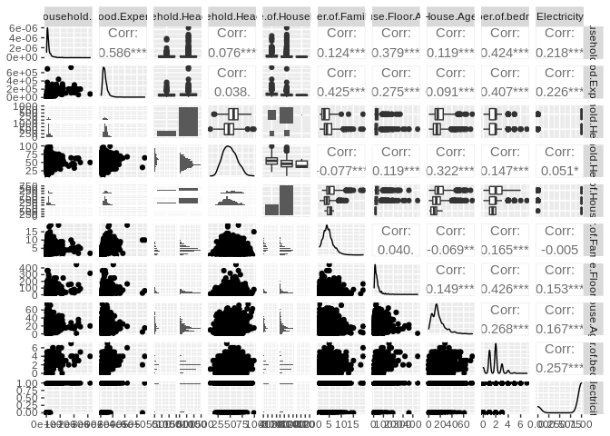
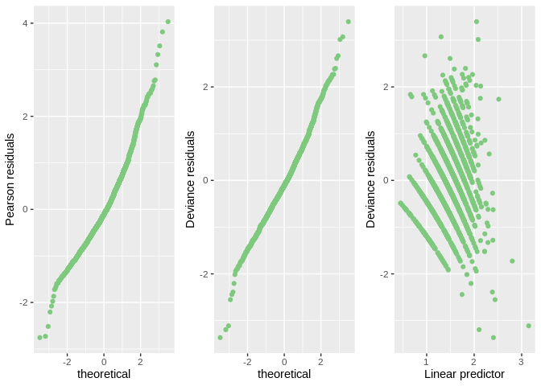
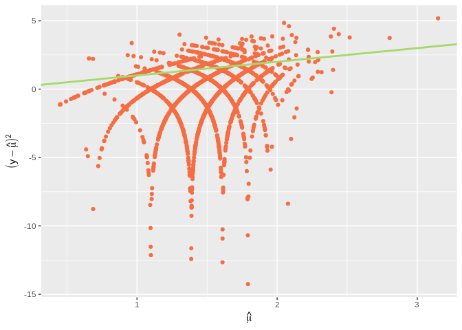

Group\_04
================
Suraj Kumar
17/07/2021

<!-- -->

# Introduction

# Exploratory Data Analysis

# Formal Data Analysis

we fit a poisson model as our response is a count variable. We have
excluded Region as a covariate because there was only one factor.

    Call:
    glm(formula = Total.Number.of.Family.members ~ log(Total.Household.Income) * 
        Household.Head.Age + log(Total.Food.Expenditure) + Type.of.Household + 
        sqrt(House.Floor.Area) + House.Age + Number.of.bedrooms + 
        Electricity, family = "poisson", data = data)

    Deviance Residuals: 
        Min       1Q   Median       3Q      Max  
    -3.3643  -0.5747  -0.1084   0.4285   3.3970  

    Coefficients:
                                                              Estimate Std. Error
    (Intercept)                                             -1.4412677  0.6496268
    log(Total.Household.Income)                             -0.2608649  0.0541301
    Household.Head.Age                                      -0.0325290  0.0117005
    log(Total.Food.Expenditure)                              0.5961661  0.0287287
    Type.of.HouseholdSingle Family                          -0.2697590  0.0230558
    Type.of.HouseholdTwo or More Nonrelated Persons/Members -0.0269692  0.1809345
    sqrt(House.Floor.Area)                                  -0.0178763  0.0055729
    House.Age                                               -0.0039878  0.0010318
    Number.of.bedrooms                                       0.0230408  0.0128409
    Electricity                                             -0.1546339  0.0299597
    log(Total.Household.Income):Household.Head.Age           0.0024897  0.0009981
                                                            z value Pr(>|z|)    
    (Intercept)                                              -2.219 0.026513 *  
    log(Total.Household.Income)                              -4.819 1.44e-06 ***
    Household.Head.Age                                       -2.780 0.005434 ** 
    log(Total.Food.Expenditure)                              20.752  < 2e-16 ***
    Type.of.HouseholdSingle Family                          -11.700  < 2e-16 ***
    Type.of.HouseholdTwo or More Nonrelated Persons/Members  -0.149 0.881510    
    sqrt(House.Floor.Area)                                   -3.208 0.001338 ** 
    House.Age                                                -3.865 0.000111 ***
    Number.of.bedrooms                                        1.794 0.072760 .  
    Electricity                                              -5.161 2.45e-07 ***
    log(Total.Household.Income):Household.Head.Age            2.494 0.012620 *  
    ---
    Signif. codes:  0 '***' 0.001 '**' 0.01 '*' 0.05 '.' 0.1 ' ' 1

    (Dispersion parameter for poisson family taken to be 1)

        Null deviance: 2217.8  on 2121  degrees of freedom
    Residual deviance: 1336.9  on 2111  degrees of freedom
    AIC: 8296.9

    Number of Fisher Scoring iterations: 4

<table>
<thead>
<tr>
<th style="text-align:left;">
</th>
<th style="text-align:right;">
2.5 %
</th>
<th style="text-align:right;">
97.5 %
</th>
</tr>
</thead>
<tbody>
<tr>
<td style="text-align:left;">
(Intercept)
</td>
<td style="text-align:right;">
-2.7152526
</td>
<td style="text-align:right;">
-0.1688543
</td>
</tr>
<tr>
<td style="text-align:left;">
log(Total.Household.Income)
</td>
<td style="text-align:right;">
-0.3670496
</td>
<td style="text-align:right;">
-0.1548714
</td>
</tr>
<tr>
<td style="text-align:left;">
Household.Head.Age
</td>
<td style="text-align:right;">
-0.0554479
</td>
<td style="text-align:right;">
-0.0095849
</td>
</tr>
<tr>
<td style="text-align:left;">
log(Total.Food.Expenditure)
</td>
<td style="text-align:right;">
0.5396511
</td>
<td style="text-align:right;">
0.6522564
</td>
</tr>
<tr>
<td style="text-align:left;">
Type.of.HouseholdSingle Family
</td>
<td style="text-align:right;">
-0.3148743
</td>
<td style="text-align:right;">
-0.2244942
</td>
</tr>
<tr>
<td style="text-align:left;">
Type.of.HouseholdTwo or More Nonrelated Persons/Members
</td>
<td style="text-align:right;">
-0.4032378
</td>
<td style="text-align:right;">
0.3084597
</td>
</tr>
<tr>
<td style="text-align:left;">
sqrt(House.Floor.Area)
</td>
<td style="text-align:right;">
-0.0288674
</td>
<td style="text-align:right;">
-0.0070222
</td>
</tr>
<tr>
<td style="text-align:left;">
House.Age
</td>
<td style="text-align:right;">
-0.0060189
</td>
<td style="text-align:right;">
-0.0019741
</td>
</tr>
<tr>
<td style="text-align:left;">
Number.of.bedrooms
</td>
<td style="text-align:right;">
-0.0021447
</td>
<td style="text-align:right;">
0.0481903
</td>
</tr>
<tr>
<td style="text-align:left;">
Electricity
</td>
<td style="text-align:right;">
-0.2131185
</td>
<td style="text-align:right;">
-0.0956715
</td>
</tr>
<tr>
<td style="text-align:left;">
log(Total.Household.Income):Household.Head.Age
</td>
<td style="text-align:right;">
0.0005322
</td>
<td style="text-align:right;">
0.0044447
</td>
</tr>
</tbody>
</table>

<!-- --><!-- --><!-- -->

# Conclusions

# Extention
