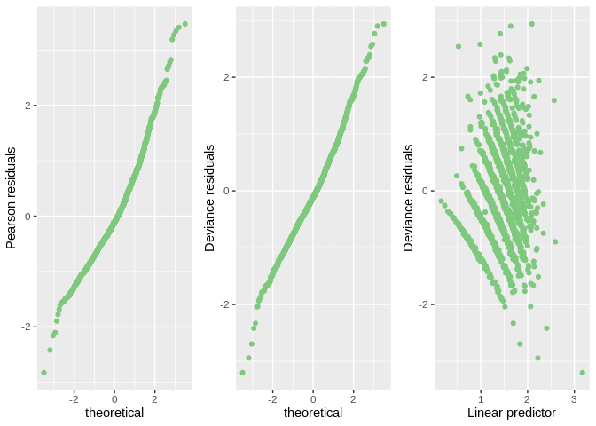

Group\_04
================
Suraj Kumar
17/07/2021

# Introduction

The Philippine government conducts surveys on household income and
expenditure every three years to understand the living conditions of
residents. In some past studies, we found that some factors may affect
the number of family members. This research studied 2122 families in
Soccsksargen district and collected the data of total household income,
total food expenditure, household head sex, household head age, type of
household, total number of family members, house floor area, house age,
number of bedrooms and electricity, the purpose is to find the
relationship between the number of family members and other variables.
This report focuses on a different analysis level through summaries,
boxplots, and general linear model. Section consists of an exploratory
data analysis of number of family members and explores the potential
relationship between member numbers and other variables. Section
contains the results from fitting a generalized linear model to the
data, as well as the assessment of the model assumptions. Concluding
remarks are given in Section .

# Exploratory Data Analysis

# Formal Data Analysis

We fit a Poisson model as our response is a count variable. We have
excluded Region as a covariate because there was only one factor. We
will start with a model that considers all the initial impressions from
the exploratory analysis. The model takes into account the interaction
between Household.Head.Age and Type.of.Household,
log(Total.Food.Expenditure ) and Type.of.Household,
log(Total.Household.Income) and Electricity, and Type.of.Household and
Electricity. We have scaled Total.Food.Expenditure,
Total.Household.Income, and House.Floor.Area by taking log
transformation to address the scalability issue in the design matrix.
Here is the summary of the described model:-

<table class="table table-striped table-hover table-condensed table-responsive" style="width: auto !important; margin-left: auto; margin-right: auto;">
<tbody>
<tr>
<td style="text-align:left;font-weight: bold;">
Observations
</td>
<td style="text-align:right;">
2122
</td>
</tr>
<tr>
<td style="text-align:left;font-weight: bold;">
Dependent variable
</td>
<td style="text-align:right;">
Total.Number.of.Family.members
</td>
</tr>
<tr>
<td style="text-align:left;font-weight: bold;">
Type
</td>
<td style="text-align:right;">
Generalized linear model
</td>
</tr>
<tr>
<td style="text-align:left;font-weight: bold;">
Family
</td>
<td style="text-align:right;">
poisson
</td>
</tr>
<tr>
<td style="text-align:left;font-weight: bold;">
Link
</td>
<td style="text-align:right;">
log
</td>
</tr>
</tbody>
</table>
<table class="table table-striped table-hover table-condensed table-responsive" style="width: auto !important; margin-left: auto; margin-right: auto;">
<tbody>
<tr>
<td style="text-align:left;font-weight: bold;">
𝛘²(25)
</td>
<td style="text-align:right;">
951.61
</td>
</tr>
<tr>
<td style="text-align:left;font-weight: bold;">
Pseudo-R² (Cragg-Uhler)
</td>
<td style="text-align:right;">
0.37
</td>
</tr>
<tr>
<td style="text-align:left;font-weight: bold;">
Pseudo-R² (McFadden)
</td>
<td style="text-align:right;">
0.10
</td>
</tr>
<tr>
<td style="text-align:left;font-weight: bold;">
AIC
</td>
<td style="text-align:right;">
8256.28
</td>
</tr>
<tr>
<td style="text-align:left;font-weight: bold;">
BIC
</td>
<td style="text-align:right;">
8403.44
</td>
</tr>
</tbody>
</table>
<table class="table table-striped table-hover table-condensed table-responsive" style="width: auto !important; margin-left: auto; margin-right: auto;border-bottom: 0;">
<thead>
<tr>
<th style="text-align:left;">
</th>
<th style="text-align:right;">
Est.
</th>
<th style="text-align:right;">
S.E.
</th>
<th style="text-align:right;">
z val.
</th>
<th style="text-align:right;">
p
</th>
</tr>
</thead>
<tbody>
<tr>
<td style="text-align:left;font-weight: bold;">
(Intercept)
</td>
<td style="text-align:right;">
-4.42
</td>
<td style="text-align:right;">
0.67
</td>
<td style="text-align:right;">
-6.61
</td>
<td style="text-align:right;">
0.00
</td>
</tr>
<tr>
<td style="text-align:left;font-weight: bold;">
Household.Head.SexMale
</td>
<td style="text-align:right;">
0.20
</td>
<td style="text-align:right;">
0.03
</td>
<td style="text-align:right;">
6.54
</td>
<td style="text-align:right;">
0.00
</td>
</tr>
<tr>
<td style="text-align:left;font-weight: bold;">
Household.Head.Age
</td>
<td style="text-align:right;">
-0.00
</td>
<td style="text-align:right;">
0.00
</td>
<td style="text-align:right;">
-0.60
</td>
<td style="text-align:right;">
0.55
</td>
</tr>
<tr>
<td style="text-align:left;font-weight: bold;">
Type.of.HouseholdSingle Family
</td>
<td style="text-align:right;">
-0.87
</td>
<td style="text-align:right;">
0.49
</td>
<td style="text-align:right;">
-1.77
</td>
<td style="text-align:right;">
0.08
</td>
</tr>
<tr>
<td style="text-align:left;font-weight: bold;">
Type.of.HouseholdTwo or More Nonrelated Persons/Members
</td>
<td style="text-align:right;">
-9.64
</td>
<td style="text-align:right;">
12.14
</td>
<td style="text-align:right;">
-0.79
</td>
<td style="text-align:right;">
0.43
</td>
</tr>
<tr>
<td style="text-align:left;font-weight: bold;">
log(Total.Food.Expenditure)
</td>
<td style="text-align:right;">
0.54
</td>
<td style="text-align:right;">
0.06
</td>
<td style="text-align:right;">
9.81
</td>
<td style="text-align:right;">
0.00
</td>
</tr>
<tr>
<td style="text-align:left;font-weight: bold;">
log(Total.Household.Income)
</td>
<td style="text-align:right;">
0.02
</td>
<td style="text-align:right;">
0.06
</td>
<td style="text-align:right;">
0.27
</td>
<td style="text-align:right;">
0.79
</td>
</tr>
<tr>
<td style="text-align:left;font-weight: bold;">
Electricity1
</td>
<td style="text-align:right;">
2.09
</td>
<td style="text-align:right;">
0.59
</td>
<td style="text-align:right;">
3.57
</td>
<td style="text-align:right;">
0.00
</td>
</tr>
<tr>
<td style="text-align:left;font-weight: bold;">
log(House.Floor.Area)
</td>
<td style="text-align:right;">
-0.05
</td>
<td style="text-align:right;">
0.02
</td>
<td style="text-align:right;">
-2.77
</td>
<td style="text-align:right;">
0.01
</td>
</tr>
<tr>
<td style="text-align:left;font-weight: bold;">
Number.of.bedrooms1
</td>
<td style="text-align:right;">
0.10
</td>
<td style="text-align:right;">
0.04
</td>
<td style="text-align:right;">
2.31
</td>
<td style="text-align:right;">
0.02
</td>
</tr>
<tr>
<td style="text-align:left;font-weight: bold;">
Number.of.bedrooms2
</td>
<td style="text-align:right;">
0.11
</td>
<td style="text-align:right;">
0.04
</td>
<td style="text-align:right;">
2.47
</td>
<td style="text-align:right;">
0.01
</td>
</tr>
<tr>
<td style="text-align:left;font-weight: bold;">
Number.of.bedrooms3
</td>
<td style="text-align:right;">
0.10
</td>
<td style="text-align:right;">
0.05
</td>
<td style="text-align:right;">
1.84
</td>
<td style="text-align:right;">
0.07
</td>
</tr>
<tr>
<td style="text-align:left;font-weight: bold;">
Number.of.bedrooms4
</td>
<td style="text-align:right;">
0.17
</td>
<td style="text-align:right;">
0.07
</td>
<td style="text-align:right;">
2.58
</td>
<td style="text-align:right;">
0.01
</td>
</tr>
<tr>
<td style="text-align:left;font-weight: bold;">
Number.of.bedrooms5
</td>
<td style="text-align:right;">
0.25
</td>
<td style="text-align:right;">
0.12
</td>
<td style="text-align:right;">
2.07
</td>
<td style="text-align:right;">
0.04
</td>
</tr>
<tr>
<td style="text-align:left;font-weight: bold;">
Number.of.bedrooms6
</td>
<td style="text-align:right;">
0.35
</td>
<td style="text-align:right;">
0.19
</td>
<td style="text-align:right;">
1.89
</td>
<td style="text-align:right;">
0.06
</td>
</tr>
<tr>
<td style="text-align:left;font-weight: bold;">
Number.of.bedrooms7
</td>
<td style="text-align:right;">
0.43
</td>
<td style="text-align:right;">
0.45
</td>
<td style="text-align:right;">
0.94
</td>
<td style="text-align:right;">
0.35
</td>
</tr>
<tr>
<td style="text-align:left;font-weight: bold;">
House.Age
</td>
<td style="text-align:right;">
-0.00
</td>
<td style="text-align:right;">
0.00
</td>
<td style="text-align:right;">
-3.59
</td>
<td style="text-align:right;">
0.00
</td>
</tr>
<tr>
<td style="text-align:left;font-weight: bold;">
Household.Head.Age:Type.of.HouseholdSingle Family
</td>
<td style="text-align:right;">
-0.00
</td>
<td style="text-align:right;">
0.00
</td>
<td style="text-align:right;">
-1.65
</td>
<td style="text-align:right;">
0.10
</td>
</tr>
<tr>
<td style="text-align:left;font-weight: bold;">
Household.Head.Age:Type.of.HouseholdTwo or More Nonrelated
Persons/Members
</td>
<td style="text-align:right;">
0.01
</td>
<td style="text-align:right;">
0.02
</td>
<td style="text-align:right;">
0.86
</td>
<td style="text-align:right;">
0.39
</td>
</tr>
<tr>
<td style="text-align:left;font-weight: bold;">
Type.of.HouseholdSingle Family:log(Total.Food.Expenditure)
</td>
<td style="text-align:right;">
0.03
</td>
<td style="text-align:right;">
0.06
</td>
<td style="text-align:right;">
0.49
</td>
<td style="text-align:right;">
0.63
</td>
</tr>
<tr>
<td style="text-align:left;font-weight: bold;">
Type.of.HouseholdTwo or More Nonrelated
Persons/Members:log(Total.Food.Expenditure)
</td>
<td style="text-align:right;">
0.92
</td>
<td style="text-align:right;">
1.39
</td>
<td style="text-align:right;">
0.66
</td>
<td style="text-align:right;">
0.51
</td>
</tr>
<tr>
<td style="text-align:left;font-weight: bold;">
Type.of.HouseholdSingle Family:log(Total.Household.Income)
</td>
<td style="text-align:right;">
0.04
</td>
<td style="text-align:right;">
0.05
</td>
<td style="text-align:right;">
0.98
</td>
<td style="text-align:right;">
0.33
</td>
</tr>
<tr>
<td style="text-align:left;font-weight: bold;">
Type.of.HouseholdTwo or More Nonrelated
Persons/Members:log(Total.Household.Income)
</td>
<td style="text-align:right;">
-0.04
</td>
<td style="text-align:right;">
0.79
</td>
<td style="text-align:right;">
-0.05
</td>
<td style="text-align:right;">
0.96
</td>
</tr>
<tr>
<td style="text-align:left;font-weight: bold;">
log(Total.Household.Income):Electricity1
</td>
<td style="text-align:right;">
-0.19
</td>
<td style="text-align:right;">
0.05
</td>
<td style="text-align:right;">
-3.63
</td>
<td style="text-align:right;">
0.00
</td>
</tr>
<tr>
<td style="text-align:left;font-weight: bold;">
Type.of.HouseholdSingle Family:Electricity1
</td>
<td style="text-align:right;">
-0.21
</td>
<td style="text-align:right;">
0.07
</td>
<td style="text-align:right;">
-3.03
</td>
<td style="text-align:right;">
0.00
</td>
</tr>
<tr>
<td style="text-align:left;font-weight: bold;">
Type.of.HouseholdTwo or More Nonrelated Persons/Members:Electricity1
</td>
<td style="text-align:right;">
-0.83
</td>
<td style="text-align:right;">
0.82
</td>
<td style="text-align:right;">
-1.01
</td>
<td style="text-align:right;">
0.31
</td>
</tr>
</tbody>
<tfoot>
<tr>
<td style="padding: 0; " colspan="100%">
 Standard errors: MLE
</td>
</tr>
</tfoot>
</table>

We can observe a lot of insignificant variables in our initial model.
However, before proceeding to the wald test to check the significance of
each variable, we, firstly, looked for any potential outliers and
checked whether assumptions are holding. We can notice that the deviance
of the model(1266.23) is much less than chi-square(2203.62). There could
be a case of underdispersion wherein the estimated variance is less than
the expected mean. We can interpret the coefficients in such a situation
but can’t rely on standard error as they are deflated.

Outlier check

We have plotted Normal\_qq\_plot for Pearson and deviance residuals. The
purpose of such plots is to identify any point that doesn’t follow the
straight line. We have also plotted deviance residuals vs. the fitted
value to check the independence and identify any pattern in the
residuals. From above Figure , we can notice one potential outlier at
the top of the qq\_plot. So, our next step is to identify and remove the
point and again fit the model. Let’s run an Outlier test:-

    No Studentized residuals with Bonferroni p < 0.05
    Largest |rstudent|:
         rstudent unadjusted p-value Bonferroni p
    2033   4.0227         5.7535e-05      0.12197

We have identified the outlier point having id 2033. We try to fit the
model again removing this outlier andcheck for the assumptions.

Assumptions checking

        Underdispersion test

    data:  model1
    z = -18.596, p-value < 2.2e-16
    alternative hypothesis: true alpha is less than 0
    sample estimates:
         alpha 
    -0.3920074 

    Single term deletions

    Model:
    Total.Number.of.Family.members ~ Household.Head.Sex + Household.Head.Age * 
        Type.of.Household + log(Total.Food.Expenditure) * Type.of.Household + 
        log(Total.Household.Income) * Type.of.Household + log(Total.Household.Income) * 
        Electricity + Type.of.Household * Electricity + log(House.Floor.Area) + 
        Number.of.bedrooms + House.Age
                                                  Df Deviance    AIC F value
    <none>                                             1250.0 8235.3        
    Household.Head.Sex                             1   1298.7 8282.0 81.5312
    log(House.Floor.Area)                          1   1258.0 8241.3 13.4105
    Number.of.bedrooms                             7   1260.3 8231.6  2.4570
    House.Age                                      1   1261.3 8244.6 18.9318
    Household.Head.Age:Type.of.Household           2   1254.1 8235.3  3.3867
    Type.of.Household:log(Total.Food.Expenditure)  2   1250.8 8232.0  0.6198
    Type.of.Household:log(Total.Household.Income)  2   1251.0 8232.3  0.8445
    log(Total.Household.Income):Electricity        1   1263.0 8246.2 21.6628
    Type.of.Household:Electricity                  2   1260.1 8241.3  8.3970
                                                     Pr(>F)    
    <none>                                                     
    Household.Head.Sex                            < 2.2e-16 ***
    log(House.Floor.Area)                         0.0002564 ***
    Number.of.bedrooms                            0.0164574 *  
    House.Age                                     1.420e-05 ***
    Household.Head.Age:Type.of.Household          0.0340044 *  
    Type.of.Household:log(Total.Food.Expenditure) 0.5381329    
    Type.of.Household:log(Total.Household.Income) 0.4299288    
    log(Total.Household.Income):Electricity       3.454e-06 ***
    Type.of.Household:Electricity                 0.0002332 ***
    ---
    Signif. codes:  0 '***' 0.001 '**' 0.01 '*' 0.05 '.' 0.1 ' ' 1

    Single term deletions

    Model:
    Total.Number.of.Family.members ~ Household.Head.Sex + Household.Head.Age * 
        Type.of.Household + log(Total.Food.Expenditure) * Type.of.Household + 
        log(Total.Household.Income) * Electricity + Type.of.Household * 
        Electricity + log(House.Floor.Area) + House.Age + Number.of.bedrooms
                                                  Df Deviance    AIC F value
    <none>                                             1251.0 8232.3        
    Household.Head.Sex                             1   1300.0 8279.3 82.1117
    log(House.Floor.Area)                          1   1258.8 8238.1 12.9858
    House.Age                                      1   1262.3 8241.6 18.9148
    Number.of.bedrooms                             7   1261.0 8228.3  2.3842
    Household.Head.Age:Type.of.Household           2   1254.8 8232.1  3.1814
    Type.of.Household:log(Total.Food.Expenditure)  2   1255.4 8232.6  3.6216
    log(Total.Household.Income):Electricity        1   1264.7 8243.9 22.8539
    Type.of.Household:Electricity                  2   1260.3 8237.5  7.7283
                                                     Pr(>F)    
    <none>                                                     
    Household.Head.Sex                            < 2.2e-16 ***
    log(House.Floor.Area)                         0.0003212 ***
    House.Age                                     1.432e-05 ***
    Number.of.bedrooms                            0.0198478 *  
    Household.Head.Age:Type.of.Household          0.0417261 *  
    Type.of.Household:log(Total.Food.Expenditure) 0.0269082 *  
    log(Total.Household.Income):Electricity       1.869e-06 ***
    Type.of.Household:Electricity                 0.0004528 ***
    ---
    Signif. codes:  0 '***' 0.001 '**' 0.01 '*' 0.05 '.' 0.1 ' ' 1

    Single term deletions

    Model:
    Total.Number.of.Family.members ~ Household.Head.Sex + Household.Head.Age + 
        log(Total.Food.Expenditure) * Type.of.Household + log(Total.Household.Income) * 
        Electricity + Type.of.Household * Electricity + log(House.Floor.Area) + 
        House.Age + Number.of.bedrooms
                                                  Df Deviance    AIC F value
    <none>                                             1254.8 8232.1        
    Household.Head.Sex                             1   1303.3 8278.6 81.0680
    Household.Head.Age                             1   1263.1 8238.4 13.8483
    log(House.Floor.Area)                          1   1262.7 8238.0 13.2018
    House.Age                                      1   1266.2 8241.5 19.0069
    Number.of.bedrooms                             7   1265.3 8228.5  2.4919
    log(Total.Food.Expenditure):Type.of.Household  2   1259.2 8232.5  3.6370
    log(Total.Household.Income):Electricity        1   1268.5 8243.8 22.8206
    Type.of.Household:Electricity                  2   1263.9 8237.2  7.5742
                                                     Pr(>F)    
    <none>                                                     
    Household.Head.Sex                            < 2.2e-16 ***
    Household.Head.Age                            0.0002034 ***
    log(House.Floor.Area)                         0.0002864 ***
    House.Age                                     1.365e-05 ***
    Number.of.bedrooms                            0.0150380 *  
    log(Total.Food.Expenditure):Type.of.Household 0.0264976 *  
    log(Total.Household.Income):Electricity       1.902e-06 ***
    Type.of.Household:Electricity                 0.0005277 ***
    ---
    Signif. codes:  0 '***' 0.001 '**' 0.01 '*' 0.05 '.' 0.1 ' ' 1

    No Studentized residuals with Bonferroni p < 0.05
    Largest |rstudent|:
          rstudent unadjusted p-value Bonferroni p
    1521 -3.463215         0.00053376           NA

<!-- -->

    [1] 0.6113809

    Call:
    glm(formula = Total.Number.of.Family.members ~ Household.Head.Sex + 
        Household.Head.Age + log(Total.Food.Expenditure) * Type.of.Household + 
        log(Total.Household.Income) * Electricity + Type.of.Household * 
        Electricity + log(House.Floor.Area) + House.Age + Number.of.bedrooms, 
        family = "poisson", data = dataset4)

    Deviance Residuals: 
        Min       1Q   Median       3Q      Max  
    -3.1996  -0.5387  -0.1097   0.4183   2.9405  

    Coefficients:
                                                                                          Estimate
    (Intercept)                                                                         -4.2823533
    Household.Head.SexMale                                                               0.2110798
    Household.Head.Age                                                                  -0.0023816
    log(Total.Food.Expenditure)                                                          0.5032097
    Type.of.HouseholdSingle Family                                                      -1.0943810
    Type.of.HouseholdTwo or More Nonrelated Persons/Members                             -7.9639107
    log(Total.Household.Income)                                                          0.0498296
    Electricity1                                                                         2.1165998
    log(House.Floor.Area)                                                               -0.0502534
    House.Age                                                                           -0.0034594
    Number.of.bedrooms1                                                                  0.1005389
    Number.of.bedrooms2                                                                  0.1088343
    Number.of.bedrooms3                                                                  0.0973565
    Number.of.bedrooms4                                                                  0.1486297
    Number.of.bedrooms5                                                                  0.2385225
    Number.of.bedrooms6                                                                  0.3587403
    Number.of.bedrooms7                                                                  0.4554365
    log(Total.Food.Expenditure):Type.of.HouseholdSingle Family                           0.0863010
    log(Total.Food.Expenditure):Type.of.HouseholdTwo or More Nonrelated Persons/Members  0.7765212
    log(Total.Household.Income):Electricity1                                            -0.1890513
    Type.of.HouseholdSingle Family:Electricity1                                         -0.1939749
    Type.of.HouseholdTwo or More Nonrelated Persons/Members:Electricity1                -0.7087339
                                                                                        Std. Error
    (Intercept)                                                                          0.5217257
    Household.Head.SexMale                                                               0.0242358
    Household.Head.Age                                                                   0.0006479
    log(Total.Food.Expenditure)                                                          0.0332601
    Type.of.HouseholdSingle Family                                                       0.3776642
    Type.of.HouseholdTwo or More Nonrelated Persons/Members                              8.7869257
    log(Total.Household.Income)                                                          0.0406058
    Electricity1                                                                         0.4582030
    log(House.Floor.Area)                                                                0.0140311
    House.Age                                                                            0.0008083
    Number.of.bedrooms1                                                                  0.0339014
    Number.of.bedrooms2                                                                  0.0345628
    Number.of.bedrooms3                                                                  0.0411376
    Number.of.bedrooms4                                                                  0.0526165
    Number.of.bedrooms5                                                                  0.0923139
    Number.of.bedrooms6                                                                  0.1455098
    Number.of.bedrooms7                                                                  0.3547158
    log(Total.Food.Expenditure):Type.of.HouseholdSingle Family                           0.0342686
    log(Total.Food.Expenditure):Type.of.HouseholdTwo or More Nonrelated Persons/Members  0.8365459
    log(Total.Household.Income):Electricity1                                             0.0399125
    Type.of.HouseholdSingle Family:Electricity1                                          0.0526321
    Type.of.HouseholdTwo or More Nonrelated Persons/Members:Electricity1                 0.5769559
                                                                                        z value
    (Intercept)                                                                          -8.208
    Household.Head.SexMale                                                                8.709
    Household.Head.Age                                                                   -3.676
    log(Total.Food.Expenditure)                                                          15.130
    Type.of.HouseholdSingle Family                                                       -2.898
    Type.of.HouseholdTwo or More Nonrelated Persons/Members                              -0.906
    log(Total.Household.Income)                                                           1.227
    Electricity1                                                                          4.619
    log(House.Floor.Area)                                                                -3.582
    House.Age                                                                            -4.280
    Number.of.bedrooms1                                                                   2.966
    Number.of.bedrooms2                                                                   3.149
    Number.of.bedrooms3                                                                   2.367
    Number.of.bedrooms4                                                                   2.825
    Number.of.bedrooms5                                                                   2.584
    Number.of.bedrooms6                                                                   2.465
    Number.of.bedrooms7                                                                   1.284
    log(Total.Food.Expenditure):Type.of.HouseholdSingle Family                            2.518
    log(Total.Food.Expenditure):Type.of.HouseholdTwo or More Nonrelated Persons/Members   0.928
    log(Total.Household.Income):Electricity1                                             -4.737
    Type.of.HouseholdSingle Family:Electricity1                                          -3.685
    Type.of.HouseholdTwo or More Nonrelated Persons/Members:Electricity1                 -1.228
                                                                                        Pr(>|z|)
    (Intercept)                                                                         2.25e-16
    Household.Head.SexMale                                                               < 2e-16
    Household.Head.Age                                                                  0.000237
    log(Total.Food.Expenditure)                                                          < 2e-16
    Type.of.HouseholdSingle Family                                                      0.003758
    Type.of.HouseholdTwo or More Nonrelated Persons/Members                             0.364758
    log(Total.Household.Income)                                                         0.219764
    Electricity1                                                                        3.85e-06
    log(House.Floor.Area)                                                               0.000342
    House.Age                                                                           1.87e-05
    Number.of.bedrooms1                                                                 0.003021
    Number.of.bedrooms2                                                                 0.001639
    Number.of.bedrooms3                                                                 0.017952
    Number.of.bedrooms4                                                                 0.004731
    Number.of.bedrooms5                                                                 0.009771
    Number.of.bedrooms6                                                                 0.013686
    Number.of.bedrooms7                                                                 0.199160
    log(Total.Food.Expenditure):Type.of.HouseholdSingle Family                          0.011790
    log(Total.Food.Expenditure):Type.of.HouseholdTwo or More Nonrelated Persons/Members 0.353279
    log(Total.Household.Income):Electricity1                                            2.17e-06
    Type.of.HouseholdSingle Family:Electricity1                                         0.000228
    Type.of.HouseholdTwo or More Nonrelated Persons/Members:Electricity1                0.219296
                                                                                           
    (Intercept)                                                                         ***
    Household.Head.SexMale                                                              ***
    Household.Head.Age                                                                  ***
    log(Total.Food.Expenditure)                                                         ***
    Type.of.HouseholdSingle Family                                                      ** 
    Type.of.HouseholdTwo or More Nonrelated Persons/Members                                
    log(Total.Household.Income)                                                            
    Electricity1                                                                        ***
    log(House.Floor.Area)                                                               ***
    House.Age                                                                           ***
    Number.of.bedrooms1                                                                 ** 
    Number.of.bedrooms2                                                                 ** 
    Number.of.bedrooms3                                                                 *  
    Number.of.bedrooms4                                                                 ** 
    Number.of.bedrooms5                                                                 ** 
    Number.of.bedrooms6                                                                 *  
    Number.of.bedrooms7                                                                    
    log(Total.Food.Expenditure):Type.of.HouseholdSingle Family                          *  
    log(Total.Food.Expenditure):Type.of.HouseholdTwo or More Nonrelated Persons/Members    
    log(Total.Household.Income):Electricity1                                            ***
    Type.of.HouseholdSingle Family:Electricity1                                         ***
    Type.of.HouseholdTwo or More Nonrelated Persons/Members:Electricity1                   
    ---
    Signif. codes:  0 '***' 0.001 '**' 0.01 '*' 0.05 '.' 0.1 ' ' 1

    (Dispersion parameter for poisson family taken to be 0.6113809)

        Null deviance: 2192.3  on 2120  degrees of freedom
    Residual deviance: 1254.8  on 2099  degrees of freedom
    AIC: 8232.1

    Number of Fisher Scoring iterations: 4

# Conclusions

# Extention
