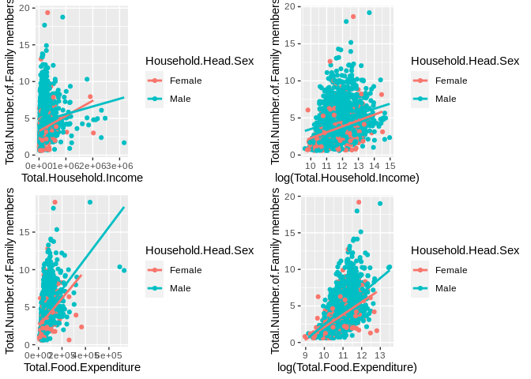
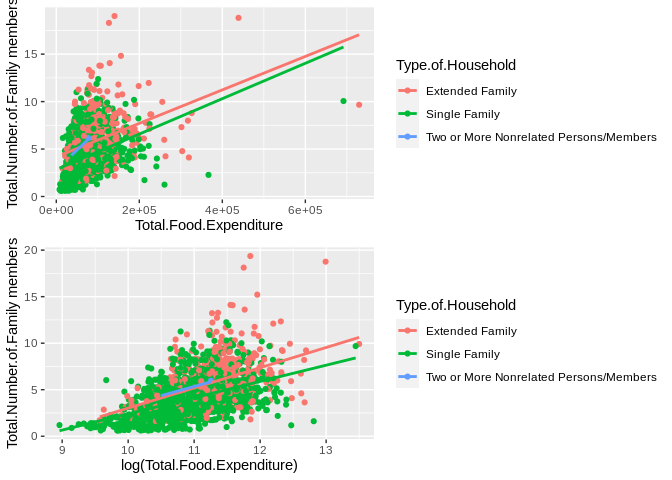
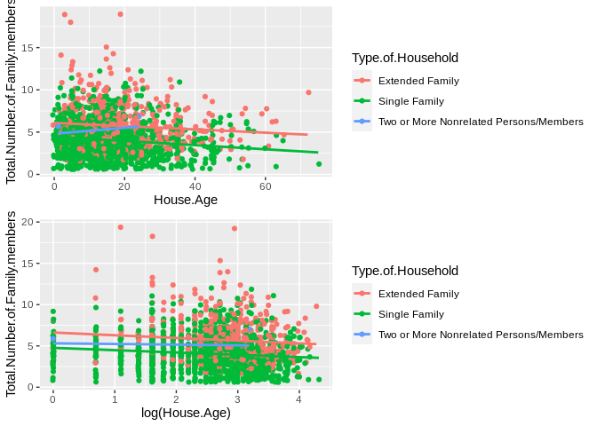
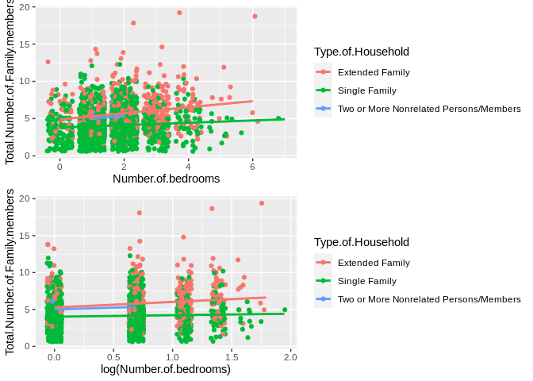
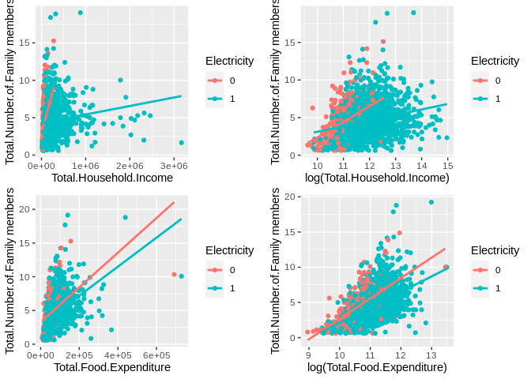

Analysis of deciding factors for number of family members in XII -
SOCCSKSARGEN Region of Philippines.
================
QingZhang, Suraj Kumar, Xin Zhang, Xinyue Shu, Yao Xiao
2021/7/18

# Introduction

The society is composed of one family, and the study of the population
of family members is of great significance to the population of the
study area. Understanding the deciding factors that affect the number of
family member numbers is helpful to understand the population situation
in the area, predict future population development trends and make
timely policy adjustments. The Philippine government conducts surveys on
household income and expenditure every three years to understand the
living conditions of residents, dataset comes from the FIES (Family
Income and Expenditure Survey) recorded in the Philippines.

In some past studies, we found that some factors may affect the number
of family members. This research studied 2122 families in Soccsksargen
district and collected the data of total household income, total food
expenditure, household head sex, household head age, type of household,
total number of family members, house floor area, house age, number of
bedrooms and electricity, the purpose is to find the relationship
between the number of family members and other variables. This report
focuses on a different analysis level through summaries, boxplots, and
general linear model. Section consists of an exploratory data analysis
of number of family members and explores the potential relationship
between member numbers and other variables. Section contains the results
from fitting a generalized linear model to the data, as well as the
assessment of the model assumptions. Concluding remarks are given in
Section .

# Exploratory data analysis

The data set contains 2122 observations with no missing value, and
records a total of 10 variables, including three categorical variables
and seven numerical variables. shows the general information of the data
set, including mean, standard deviation, quartile, etc. For making it
clearer, this part of the analysis will covertly analyze different
categorical variables one by one.

<table style="width: auto;" class="table table-condensed">
<caption>
Data summary
</caption>
<thead>
<tr>
<th style="text-align:left;">
</th>
<th style="text-align:left;">
</th>
</tr>
</thead>
<tbody>
<tr>
<td style="text-align:left;">
Name
</td>
<td style="text-align:left;">
dataset4
</td>
</tr>
<tr>
<td style="text-align:left;">
Number of rows
</td>
<td style="text-align:left;">
2122
</td>
</tr>
<tr>
<td style="text-align:left;">
Number of columns
</td>
<td style="text-align:left;">
10
</td>
</tr>
<tr>
<td style="text-align:left;">
\_\_\_\_\_\_\_\_\_\_\_\_\_\_\_\_\_\_\_\_\_\_\_
</td>
<td style="text-align:left;">
</td>
</tr>
<tr>
<td style="text-align:left;">
Column type frequency:
</td>
<td style="text-align:left;">
</td>
</tr>
<tr>
<td style="text-align:left;">
factor
</td>
<td style="text-align:left;">
3
</td>
</tr>
<tr>
<td style="text-align:left;">
numeric
</td>
<td style="text-align:left;">
7
</td>
</tr>
<tr>
<td style="text-align:left;">
\_\_\_\_\_\_\_\_\_\_\_\_\_\_\_\_\_\_\_\_\_\_\_\_
</td>
<td style="text-align:left;">
</td>
</tr>
<tr>
<td style="text-align:left;">
Group variables
</td>
<td style="text-align:left;">
None
</td>
</tr>
</tbody>
</table>

**Variable type: factor**

<table>
<thead>
<tr>
<th style="text-align:left;">
skim\_variable
</th>
<th style="text-align:right;">
n\_missing
</th>
<th style="text-align:right;">
complete\_rate
</th>
<th style="text-align:left;">
ordered
</th>
<th style="text-align:right;">
n\_unique
</th>
<th style="text-align:left;">
top\_counts
</th>
</tr>
</thead>
<tbody>
<tr>
<td style="text-align:left;">
Household.Head.Sex
</td>
<td style="text-align:right;">
0
</td>
<td style="text-align:right;">
1
</td>
<td style="text-align:left;">
FALSE
</td>
<td style="text-align:right;">
2
</td>
<td style="text-align:left;">
Mal: 1760, Fem: 362
</td>
</tr>
<tr>
<td style="text-align:left;">
Type.of.Household
</td>
<td style="text-align:right;">
0
</td>
<td style="text-align:right;">
1
</td>
<td style="text-align:left;">
FALSE
</td>
<td style="text-align:right;">
3
</td>
<td style="text-align:left;">
Sin: 1531, Ext: 585, Two: 6
</td>
</tr>
<tr>
<td style="text-align:left;">
Electricity
</td>
<td style="text-align:right;">
0
</td>
<td style="text-align:right;">
1
</td>
<td style="text-align:left;">
FALSE
</td>
<td style="text-align:right;">
2
</td>
<td style="text-align:left;">
1: 1759, 0: 363
</td>
</tr>
</tbody>
</table>

**Variable type: numeric**

<table>
<thead>
<tr>
<th style="text-align:left;">
skim\_variable
</th>
<th style="text-align:right;">
n\_missing
</th>
<th style="text-align:right;">
complete\_rate
</th>
<th style="text-align:right;">
mean
</th>
<th style="text-align:right;">
sd
</th>
<th style="text-align:right;">
p0
</th>
<th style="text-align:right;">
p25
</th>
<th style="text-align:right;">
p50
</th>
<th style="text-align:right;">
p75
</th>
<th style="text-align:right;">
p100
</th>
<th style="text-align:left;">
hist
</th>
</tr>
</thead>
<tbody>
<tr>
<td style="text-align:left;">
Total.Household.Income
</td>
<td style="text-align:right;">
0
</td>
<td style="text-align:right;">
1
</td>
<td style="text-align:right;">
182984.80
</td>
<td style="text-align:right;">
228231.07
</td>
<td style="text-align:right;">
15204
</td>
<td style="text-align:right;">
75693.25
</td>
<td style="text-align:right;">
120362.0
</td>
<td style="text-align:right;">
194676.00
</td>
<td style="text-align:right;">
3168662
</td>
<td style="text-align:left;">
▇▁▁▁▁
</td>
</tr>
<tr>
<td style="text-align:left;">
Total.Food.Expenditure
</td>
<td style="text-align:right;">
0
</td>
<td style="text-align:right;">
1
</td>
<td style="text-align:right;">
71738.09
</td>
<td style="text-align:right;">
44938.17
</td>
<td style="text-align:right;">
7783
</td>
<td style="text-align:right;">
44149.50
</td>
<td style="text-align:right;">
63305.5
</td>
<td style="text-align:right;">
87802.25
</td>
<td style="text-align:right;">
729606
</td>
<td style="text-align:left;">
▇▁▁▁▁
</td>
</tr>
<tr>
<td style="text-align:left;">
Household.Head.Age
</td>
<td style="text-align:right;">
0
</td>
<td style="text-align:right;">
1
</td>
<td style="text-align:right;">
49.28
</td>
<td style="text-align:right;">
14.16
</td>
<td style="text-align:right;">
9
</td>
<td style="text-align:right;">
39.00
</td>
<td style="text-align:right;">
48.0
</td>
<td style="text-align:right;">
59.00
</td>
<td style="text-align:right;">
99
</td>
<td style="text-align:left;">
▁▇▇▃▁
</td>
</tr>
<tr>
<td style="text-align:left;">
Total.Number.of.Family.members
</td>
<td style="text-align:right;">
0
</td>
<td style="text-align:right;">
1
</td>
<td style="text-align:right;">
4.53
</td>
<td style="text-align:right;">
2.22
</td>
<td style="text-align:right;">
1
</td>
<td style="text-align:right;">
3.00
</td>
<td style="text-align:right;">
4.0
</td>
<td style="text-align:right;">
6.00
</td>
<td style="text-align:right;">
19
</td>
<td style="text-align:left;">
▇▆▁▁▁
</td>
</tr>
<tr>
<td style="text-align:left;">
House.Floor.Area
</td>
<td style="text-align:right;">
0
</td>
<td style="text-align:right;">
1
</td>
<td style="text-align:right;">
35.74
</td>
<td style="text-align:right;">
34.67
</td>
<td style="text-align:right;">
5
</td>
<td style="text-align:right;">
16.00
</td>
<td style="text-align:right;">
26.5
</td>
<td style="text-align:right;">
40.00
</td>
<td style="text-align:right;">
450
</td>
<td style="text-align:left;">
▇▁▁▁▁
</td>
</tr>
<tr>
<td style="text-align:left;">
House.Age
</td>
<td style="text-align:right;">
0
</td>
<td style="text-align:right;">
1
</td>
<td style="text-align:right;">
16.30
</td>
<td style="text-align:right;">
11.09
</td>
<td style="text-align:right;">
0
</td>
<td style="text-align:right;">
9.00
</td>
<td style="text-align:right;">
14.0
</td>
<td style="text-align:right;">
21.00
</td>
<td style="text-align:right;">
75
</td>
<td style="text-align:left;">
▇▅▁▁▁
</td>
</tr>
<tr>
<td style="text-align:left;">
Number.of.bedrooms
</td>
<td style="text-align:right;">
0
</td>
<td style="text-align:right;">
1
</td>
<td style="text-align:right;">
1.77
</td>
<td style="text-align:right;">
1.00
</td>
<td style="text-align:right;">
0
</td>
<td style="text-align:right;">
1.00
</td>
<td style="text-align:right;">
2.0
</td>
<td style="text-align:right;">
2.00
</td>
<td style="text-align:right;">
7
</td>
<td style="text-align:left;">
▇▇▃▁▁
</td>
</tr>
</tbody>
</table>

## Household Head Sex

The number of family members in male-headed households is slightly
scattered than female-headed households. Figure shows that there are 3
outliers in the data of female-headed households, and 7 outliers in the
data of male-headed households.

<div class="figure" style="text-align: center">


<p class="caption">
Boxplot of family member numbers by household head sex
</p>

</div>

According to the average and quartiles provided in table , households
with male heads are more likely to have more members. The average of
families members of male household head is 4.72, and the average of
female head families is 3.63. The standard deviation of the number of
members of male-headed households is 2.19, and the standard deviation of
the number of members of female-headed households is 2.13, again
confirming the conclusion drawn by the box plot that the number of
members of male-headed households is slightly scattered, however, both
kind of families have the value range of the number of members is the
same (between 1 and 19).

<table class="table" style="margin-left: auto; margin-right: auto;">
<caption>
Summary statistics on total number of family members by sex.
</caption>
<thead>
<tr>
<th style="text-align:left;">
Household.Head.Sex
</th>
<th style="text-align:right;">
n
</th>
<th style="text-align:right;">
Mean
</th>
<th style="text-align:right;">
St.Dev
</th>
<th style="text-align:right;">
Min
</th>
<th style="text-align:right;">
Q1
</th>
<th style="text-align:right;">
Median
</th>
<th style="text-align:right;">
Q3
</th>
<th style="text-align:right;">
Max
</th>
</tr>
</thead>
<tbody>
<tr>
<td style="text-align:left;">
Female
</td>
<td style="text-align:right;">
362
</td>
<td style="text-align:right;">
3.63
</td>
<td style="text-align:right;">
2.13
</td>
<td style="text-align:right;">
1
</td>
<td style="text-align:right;">
2
</td>
<td style="text-align:right;">
3
</td>
<td style="text-align:right;">
5
</td>
<td style="text-align:right;">
19
</td>
</tr>
<tr>
<td style="text-align:left;">
Male
</td>
<td style="text-align:right;">
1760
</td>
<td style="text-align:right;">
4.72
</td>
<td style="text-align:right;">
2.19
</td>
<td style="text-align:right;">
1
</td>
<td style="text-align:right;">
3
</td>
<td style="text-align:right;">
4
</td>
<td style="text-align:right;">
6
</td>
<td style="text-align:right;">
19
</td>
</tr>
</tbody>
</table>

Figure are used to show the relationship between the 6 numerical
explanatory variables and the number of family members in the response
variable when the gender of the head of the household is different. In
order to better show the relationship between variables, we performed a
logarithmic transformation (the left column is y\~x, the right column is
y\~log(x)).

When considerring the gender of the head of the household, the four
variables of total household income, total food expenditure, house floor
area and the number of bedrooms are positively correlated with the
number of household members, at the same time, household head age and
house age have weak negative relationships with member numbers.What’s
more, income may be interactive with household head sex.



<div class="figure" style="text-align: center">


<p class="caption">
sctter plots of family member numbers by household head sex
</p>

</div>

## Type of Household

Judging intuitively from figure , we believe that the data of the
Extended Family type is more widely distributed and has more outliers.
The distribution of the number of members of the Two or More Nonrelated
Persons/Members type has the smallest value range and no outliers. We
think this may be due to the small number of observations of this type.
In addition, we can see from the figure that the average family members
of the Extended Family type are higher than the Single Family type, and
roughly the same as the Two or More Nonrelated Persons/Members type.

<div class="figure" style="text-align: center">


<p class="caption">
Boxplot of total numbers of family members by type of house
</p>

</div>

There are three types of Household, Extended Family, Single Family, Two
or More Nonrelated Persons/Members (Two or More Nonrelated
Persons/Members type only accounts for a small part of observations).
According to the table , the single family type has the lowest average
size of 4.07, and the extended family type has the largest average size
of 5.73. The family size of Extended Family ranges from 2 to 19, which
is more scattered than the other two types. This result is also logical
from a literal point of view.

<table class="table" style="margin-left: auto; margin-right: auto;">
<caption>
Summary statistics on total number of family members by type of
household.
</caption>
<thead>
<tr>
<th style="text-align:left;">
Type.of.Household
</th>
<th style="text-align:right;">
n
</th>
<th style="text-align:right;">
Mean
</th>
<th style="text-align:right;">
St.Dev
</th>
<th style="text-align:right;">
Min
</th>
<th style="text-align:right;">
Q1
</th>
<th style="text-align:right;">
Median
</th>
<th style="text-align:right;">
Q3
</th>
<th style="text-align:right;">
Max
</th>
</tr>
</thead>
<tbody>
<tr>
<td style="text-align:left;">
Extended Family
</td>
<td style="text-align:right;">
585
</td>
<td style="text-align:right;">
5.73
</td>
<td style="text-align:right;">
2.47
</td>
<td style="text-align:right;">
2
</td>
<td style="text-align:right;">
4.00
</td>
<td style="text-align:right;">
5.0
</td>
<td style="text-align:right;">
7
</td>
<td style="text-align:right;">
19
</td>
</tr>
<tr>
<td style="text-align:left;">
Single Family
</td>
<td style="text-align:right;">
1531
</td>
<td style="text-align:right;">
4.07
</td>
<td style="text-align:right;">
1.92
</td>
<td style="text-align:right;">
1
</td>
<td style="text-align:right;">
3.00
</td>
<td style="text-align:right;">
4.0
</td>
<td style="text-align:right;">
5
</td>
<td style="text-align:right;">
12
</td>
</tr>
<tr>
<td style="text-align:left;">
Two or More Nonrelated Persons/Members
</td>
<td style="text-align:right;">
6
</td>
<td style="text-align:right;">
5.17
</td>
<td style="text-align:right;">
1.47
</td>
<td style="text-align:right;">
3
</td>
<td style="text-align:right;">
4.25
</td>
<td style="text-align:right;">
5.5
</td>
<td style="text-align:right;">
6
</td>
<td style="text-align:right;">
7
</td>
</tr>
</tbody>
</table>

Figure contains 18 scatter plots, they are used to show the relationship
between the 6 numerical explanatory variables and the number of family
members in the response variable of different types of household in 3
different methods (by using raw data, logarithmic conversion, square
root conversion to draw the plots).

Total household income, total food expenditure have weak positive
relationships with member numbers, while the rest of variables seem have
no significant relationships with response variables.



<div class="figure" style="text-align: center">


<p class="caption">
sctter plots of family member numbers by type of household
</p>

</div>

## Electricity

According to figure , whether the family is powered on has little effect
on the average and distribution range of the number of family members. 4
and 6 outliers appear in unpowered and power-on conditions respectively.

<div class="figure" style="text-align: center">


<p class="caption">
Boxplot of family member numbers by electricity
</p>

</div>

Table shows the summary statistics on the family member numbers and
electricity of all observations, and there are 363 families has no
electricity while 1759 families has electricity.The average member
number of families has electricity is 4.53 which is almost the same as
those with no electrity (4.56), and distributions of two conditions are
really similar.

<table class="table" style="margin-left: auto; margin-right: auto;">
<caption>
Summary statistics on total number of family members by Electricity.
</caption>
<thead>
<tr>
<th style="text-align:left;">
Electricity
</th>
<th style="text-align:right;">
n
</th>
<th style="text-align:right;">
Mean
</th>
<th style="text-align:right;">
St.Dev
</th>
<th style="text-align:right;">
Min
</th>
<th style="text-align:right;">
Q1
</th>
<th style="text-align:right;">
Median
</th>
<th style="text-align:right;">
Q3
</th>
<th style="text-align:right;">
Max
</th>
</tr>
</thead>
<tbody>
<tr>
<td style="text-align:left;">
0
</td>
<td style="text-align:right;">
363
</td>
<td style="text-align:right;">
4.56
</td>
<td style="text-align:right;">
2.42
</td>
<td style="text-align:right;">
1
</td>
<td style="text-align:right;">
3
</td>
<td style="text-align:right;">
4
</td>
<td style="text-align:right;">
6
</td>
<td style="text-align:right;">
15
</td>
</tr>
<tr>
<td style="text-align:left;">
1
</td>
<td style="text-align:right;">
1759
</td>
<td style="text-align:right;">
4.53
</td>
<td style="text-align:right;">
2.17
</td>
<td style="text-align:right;">
1
</td>
<td style="text-align:right;">
3
</td>
<td style="text-align:right;">
4
</td>
<td style="text-align:right;">
6
</td>
<td style="text-align:right;">
19
</td>
</tr>
</tbody>
</table>

Figure scatter plots are used to show the relationship between the 6
numerical explanatory variables and the number of family members in the
response variable when considering whether the family is powered. The
left column is scatter plots of response variables vs explanatory
variables, and the right column is scatter plots of response variables
vs log(explanatory variables).

Total household income, total food expenditure, house floor area and the
number of bedrooms are positively correlated with the number of
household members, at the same time, household head age and house age
have weak negative relationships with member numbers. What else, we
consider that there may be interactions between income and electricity,
food expenditure and electricity, household head age and electricity,
bedrooms numbers and electricity.



<div class="figure" style="text-align: center">


<p class="caption">
Sctter plots of family member numbers by electricity
</p>

</div>

Correlations of variables are calculated to check whether there are
multicollinearity between variables. From graph we can draw a
preliminary conclusion that multicollinearity exists in the data. 1.
Total.Food.Expenditure, House.Floor.Area and Number.of.bedrooms have a
weak collinearity with Total.Household.Income (The correlations are
respectively 0.586, 0.379 and 0.424); 2. Number.of.bedrooms has a weak
collinearity with Total.Food.Expenditure (correlation is 0.407),
House.Age has a weak collinearity with Total.Food.Expenditure
(correlation is 0.322) 3. Number.of.bedrooms has a weak collinearity
with House.Floor.Area (correlation is 0.426).

<div class="figure" style="text-align: center">


<p class="caption">
Matrix of plots with data set
</p>

</div>

The proportion of female-headed households being extended is higher than
that of male-headed households (41.7% and 24.7%, respectively), and
male-headed households accounted for 75.1%, accounting for the main
part.

    ##                       Type.of.Household      Female         Male
    ##                         Extended Family 25.8% (151) 74.2%  (434)
    ##                           Single Family 13.7% (210) 86.3% (1321)
    ##  Two or More Nonrelated Persons/Members 16.7%   (1) 83.3%    (5)

The vast majority of households are electrified, and the electrification
rates of male and female households both exceed 82%, and the difference
is no more than 2%. Therefore, it seems that there is no obvious
relationship between the gender of different household heads and whether
they are electrified.

    ##  Household.Head.Sex           0            1
    ##              Female 16.0%  (58) 84.0%  (304)
    ##                Male 17.3% (305) 82.7% (1455)

The majority of households have electricity. The proportion of large
families with electricity is 88.5%, which is nearly 8% higher than that
of single families.

    ##                       Type.of.Household           0            1
    ##                         Extended Family 11.5%  (67) 88.5%  (518)
    ##                           Single Family 19.3% (295) 80.7% (1236)
    ##  Two or More Nonrelated Persons/Members 16.7%   (1) 83.3%    (5)

# Formal Data Analysis

We fit a Poisson model as our response is a count variable. We have
excluded Region as a covariate because there was only one factor. We
will start with a model that considers all the initial impressions from
the exploratory analysis. The model takes into account the interaction
between log(Household.Head.Age) and Type.of.Household,
log(Total.Food.Expenditure ) and Type.of.Household,
log(Total.Household.Income) and Electricity, and Type.of.Household and
Electricity. We have scaled Total.Food.Expenditure,
Total.Household.Income, Household.Head.Age, and House.Floor.Area by
taking log transformation to address the scalability issue in the design
matrix. Here is the summary of the described model:-

``` r
#fitted the glm poisson model with 5 potential interaction terms as mentioned earlier 
model1 <- glm(Total.Number.of.Family.members ~ 
                Household.Head.Sex                                  +
                
                log(Household.Head.Age)*   Type.of.Household        + 
                log(Total.Food.Expenditure ) * Type.of.Household    +
                log(Total.Household.Income) * Type.of.Household     +
                log(Total.Household.Income) * Electricity           +
                Type.of.Household*Electricity                       +
                log(House.Floor.Area)                               +
                Number.of.bedrooms                                  +
                House.Age                                                           
                                                 
               ,data = dataset4,family = "poisson")  
#produced the model summary using pipeline summ command from jtools
model1 %>%
  summ()
```

<table class="table table-striped table-hover table-condensed table-responsive" style="width: auto !important; margin-left: auto; margin-right: auto;">
<tbody>
<tr>
<td style="text-align:left;font-weight: bold;">
Observations
</td>
<td style="text-align:right;">
2122
</td>
</tr>
<tr>
<td style="text-align:left;font-weight: bold;">
Dependent variable
</td>
<td style="text-align:right;">
Total.Number.of.Family.members
</td>
</tr>
<tr>
<td style="text-align:left;font-weight: bold;">
Type
</td>
<td style="text-align:right;">
Generalized linear model
</td>
</tr>
<tr>
<td style="text-align:left;font-weight: bold;">
Family
</td>
<td style="text-align:right;">
poisson
</td>
</tr>
<tr>
<td style="text-align:left;font-weight: bold;">
Link
</td>
<td style="text-align:right;">
log
</td>
</tr>
</tbody>
</table>
<table class="table table-striped table-hover table-condensed table-responsive" style="width: auto !important; margin-left: auto; margin-right: auto;">
<tbody>
<tr>
<td style="text-align:left;font-weight: bold;">
𝛘²(19)
</td>
<td style="text-align:right;">
937.81
</td>
</tr>
<tr>
<td style="text-align:left;font-weight: bold;">
Pseudo-R² (Cragg-Uhler)
</td>
<td style="text-align:right;">
0.36
</td>
</tr>
<tr>
<td style="text-align:left;font-weight: bold;">
Pseudo-R² (McFadden)
</td>
<td style="text-align:right;">
0.10
</td>
</tr>
<tr>
<td style="text-align:left;font-weight: bold;">
AIC
</td>
<td style="text-align:right;">
8258.08
</td>
</tr>
<tr>
<td style="text-align:left;font-weight: bold;">
BIC
</td>
<td style="text-align:right;">
8371.29
</td>
</tr>
</tbody>
</table>
<table class="table table-striped table-hover table-condensed table-responsive" style="width: auto !important; margin-left: auto; margin-right: auto;border-bottom: 0;">
<thead>
<tr>
<th style="text-align:left;">
</th>
<th style="text-align:right;">
Est.
</th>
<th style="text-align:right;">
S.E.
</th>
<th style="text-align:right;">
z val.
</th>
<th style="text-align:right;">
p
</th>
</tr>
</thead>
<tbody>
<tr>
<td style="text-align:left;font-weight: bold;">
(Intercept)
</td>
<td style="text-align:right;">
-4.29
</td>
<td style="text-align:right;">
0.71
</td>
<td style="text-align:right;">
-6.00
</td>
<td style="text-align:right;">
0.00
</td>
</tr>
<tr>
<td style="text-align:left;font-weight: bold;">
Household.Head.SexMale
</td>
<td style="text-align:right;">
0.21
</td>
<td style="text-align:right;">
0.03
</td>
<td style="text-align:right;">
6.80
</td>
<td style="text-align:right;">
0.00
</td>
</tr>
<tr>
<td style="text-align:left;font-weight: bold;">
log(Household.Head.Age)
</td>
<td style="text-align:right;">
-0.02
</td>
<td style="text-align:right;">
0.07
</td>
<td style="text-align:right;">
-0.28
</td>
<td style="text-align:right;">
0.78
</td>
</tr>
<tr>
<td style="text-align:left;font-weight: bold;">
Type.of.HouseholdSingle Family
</td>
<td style="text-align:right;">
-0.68
</td>
<td style="text-align:right;">
0.57
</td>
<td style="text-align:right;">
-1.19
</td>
<td style="text-align:right;">
0.23
</td>
</tr>
<tr>
<td style="text-align:left;font-weight: bold;">
Type.of.HouseholdTwo or More Nonrelated Persons/Members
</td>
<td style="text-align:right;">
-11.18
</td>
<td style="text-align:right;">
12.66
</td>
<td style="text-align:right;">
-0.88
</td>
<td style="text-align:right;">
0.38
</td>
</tr>
<tr>
<td style="text-align:left;font-weight: bold;">
log(Total.Food.Expenditure)
</td>
<td style="text-align:right;">
0.54
</td>
<td style="text-align:right;">
0.06
</td>
<td style="text-align:right;">
9.86
</td>
<td style="text-align:right;">
0.00
</td>
</tr>
<tr>
<td style="text-align:left;font-weight: bold;">
log(Total.Household.Income)
</td>
<td style="text-align:right;">
0.01
</td>
<td style="text-align:right;">
0.06
</td>
<td style="text-align:right;">
0.19
</td>
<td style="text-align:right;">
0.85
</td>
</tr>
<tr>
<td style="text-align:left;font-weight: bold;">
Electricity1
</td>
<td style="text-align:right;">
2.06
</td>
<td style="text-align:right;">
0.58
</td>
<td style="text-align:right;">
3.53
</td>
<td style="text-align:right;">
0.00
</td>
</tr>
<tr>
<td style="text-align:left;font-weight: bold;">
log(House.Floor.Area)
</td>
<td style="text-align:right;">
-0.05
</td>
<td style="text-align:right;">
0.02
</td>
<td style="text-align:right;">
-2.80
</td>
<td style="text-align:right;">
0.01
</td>
</tr>
<tr>
<td style="text-align:left;font-weight: bold;">
Number.of.bedrooms
</td>
<td style="text-align:right;">
0.03
</td>
<td style="text-align:right;">
0.01
</td>
<td style="text-align:right;">
2.27
</td>
<td style="text-align:right;">
0.02
</td>
</tr>
<tr>
<td style="text-align:left;font-weight: bold;">
House.Age
</td>
<td style="text-align:right;">
-0.00
</td>
<td style="text-align:right;">
0.00
</td>
<td style="text-align:right;">
-3.96
</td>
<td style="text-align:right;">
0.00
</td>
</tr>
<tr>
<td style="text-align:left;font-weight: bold;">
log(Household.Head.Age):Type.of.HouseholdSingle Family
</td>
<td style="text-align:right;">
-0.08
</td>
<td style="text-align:right;">
0.08
</td>
<td style="text-align:right;">
-1.05
</td>
<td style="text-align:right;">
0.29
</td>
</tr>
<tr>
<td style="text-align:left;font-weight: bold;">
log(Household.Head.Age):Type.of.HouseholdTwo or More Nonrelated
Persons/Members
</td>
<td style="text-align:right;">
0.64
</td>
<td style="text-align:right;">
0.77
</td>
<td style="text-align:right;">
0.83
</td>
<td style="text-align:right;">
0.41
</td>
</tr>
<tr>
<td style="text-align:left;font-weight: bold;">
Type.of.HouseholdSingle Family:log(Total.Food.Expenditure)
</td>
<td style="text-align:right;">
0.04
</td>
<td style="text-align:right;">
0.06
</td>
<td style="text-align:right;">
0.62
</td>
<td style="text-align:right;">
0.53
</td>
</tr>
<tr>
<td style="text-align:left;font-weight: bold;">
Type.of.HouseholdTwo or More Nonrelated
Persons/Members:log(Total.Food.Expenditure)
</td>
<td style="text-align:right;">
0.88
</td>
<td style="text-align:right;">
1.39
</td>
<td style="text-align:right;">
0.63
</td>
<td style="text-align:right;">
0.53
</td>
</tr>
<tr>
<td style="text-align:left;font-weight: bold;">
Type.of.HouseholdSingle Family:log(Total.Household.Income)
</td>
<td style="text-align:right;">
0.04
</td>
<td style="text-align:right;">
0.05
</td>
<td style="text-align:right;">
0.82
</td>
<td style="text-align:right;">
0.41
</td>
</tr>
<tr>
<td style="text-align:left;font-weight: bold;">
Type.of.HouseholdTwo or More Nonrelated
Persons/Members:log(Total.Household.Income)
</td>
<td style="text-align:right;">
-0.01
</td>
<td style="text-align:right;">
0.79
</td>
<td style="text-align:right;">
-0.02
</td>
<td style="text-align:right;">
0.99
</td>
</tr>
<tr>
<td style="text-align:left;font-weight: bold;">
log(Total.Household.Income):Electricity1
</td>
<td style="text-align:right;">
-0.18
</td>
<td style="text-align:right;">
0.05
</td>
<td style="text-align:right;">
-3.59
</td>
<td style="text-align:right;">
0.00
</td>
</tr>
<tr>
<td style="text-align:left;font-weight: bold;">
Type.of.HouseholdSingle Family:Electricity1
</td>
<td style="text-align:right;">
-0.21
</td>
<td style="text-align:right;">
0.07
</td>
<td style="text-align:right;">
-3.03
</td>
<td style="text-align:right;">
0.00
</td>
</tr>
<tr>
<td style="text-align:left;font-weight: bold;">
Type.of.HouseholdTwo or More Nonrelated Persons/Members:Electricity1
</td>
<td style="text-align:right;">
-0.81
</td>
<td style="text-align:right;">
0.81
</td>
<td style="text-align:right;">
-0.99
</td>
<td style="text-align:right;">
0.32
</td>
</tr>
</tbody>
<tfoot>
<tr>
<td style="padding: 0; " colspan="100%">
<sup></sup> Standard errors: MLE
</td>
</tr>
</tfoot>
</table>

We can observe a lot of insignificant variables in our initial model.
However, before proceeding to the wald test to check the significance of
each variable, we, firstly, looked for any potential outliers and
checked whether assumptions are holding. We can notice that the deviance
of the model(1280.03) is much less than chi-square(2209.77). So, there
could be a case of underdispersion, wherein the estimated variance is
less than the expected mean. We can interpret the coefficients in such a
situation but can’t rely on standard error as they are deflated.

``` r
#got the pearson residual 
resp <-  model1 %>%
  resid(type = "pearson")
#got the deviance residual 
resd <- model1 %>%
  resid(type = "deviance")
#qq plot for pearson residual for normal distribution of residuals checking 
p1<-  model1 %>%
  ggplot( aes(sample = resp)) + geom_point(stat = "qq", color = "#7fc97f") +
  ylab("Pearson residuals")
#qq plot for deviance residual for normal distribution of residuals checking
p2<- model1 %>%
  ggplot( aes(sample = resd)) + geom_point(stat = "qq", color = "#7fc97f") +
  ylab("Deviance residuals")
# predicted vs residual for independence and constant variance checking. 
p3<- model1  %>%
  ggplot( aes(x = predict(model1, type="link"), y =resd))+
  geom_point(col = "#7fc97f") +
  ylab("Deviance residuals") + xlab("Linear predictor")
grid.arrange(p1, p2, p3, nrow = 1)  # to draw all images together using grid arrange
```

<div class="figure" style="text-align: center">


<p class="caption">
Outlier and Assumptions check
</p>

</div>

We have plotted Normal\_qq\_plot for Pearson and deviance residuals. The
purpose of such plots is to identify any point that doesn’t follow the
straight line. We have also plotted deviance residuals vs. the fitted
value to check the independence and identify any pattern in the
residuals. From above Figure , we can notice one potential outlier at
the top of the qq\_plot, and presence of heavy tails. So, our next step
is to identify and remove the point and again fit the model. Let’s run
an Outlier test:-

``` r
# outlier testing with outlierTest function from car library
 model1 %>%
  outlierTest() 
```

    ## No Studentized residuals with Bonferroni p < 0.05
    ## Largest |rstudent|:
    ##      rstudent unadjusted p-value Bonferroni p
    ## 2033 4.047992         5.1659e-05      0.10957

``` r
#checking for cook's distance 
cook <-cooks.distance(model1) 
cook<- as.tibble(as.data.frame(cook))
```

    ## Warning: `as.tibble()` was deprecated in tibble 2.0.0.
    ## Please use `as_tibble()` instead.
    ## The signature and semantics have changed, see `?as_tibble`.

``` r
cook %>%
  ggplot(aes(x = 1:2122,y = cook)) +
  geom_point()+
   ylab("Cook's Distance") + xlab("Index")
```

    ## Warning: Removed 1 rows containing missing values (geom_point).

<div class="figure" style="text-align: center">


<p class="caption">
Cook’s distance
</p>

</div>

We have identified the outlier point having id 2033, while the point
1521 has high influence .However, addressing outlier is totally
subjective. We try to fit the model removing outlier 2033 and check for
the assumptions again.

``` r
# remove the outlier using slice
dataset4 <- dataset4 %>%
    slice(-c(2033))
# fitted the model again, everything else being as earlier 
model1 <- glm(Total.Number.of.Family.members ~ 
                Household.Head.Sex                                                   +
                
                log(Household.Head.Age) *  Type.of.Household                         +
                log(Total.Food.Expenditure ) * Type.of.Household                     +
                log(Total.Household.Income) * Type.of.Household                      +
                log(Total.Household.Income) * Electricity                            +
                Type.of.Household * Electricity                                                         +
                log(House.Floor.Area)                                                +
                Number.of.bedrooms                                                   +
                House.Age                                                           
                                                 
               ,data = dataset4,family = "poisson") 
```

``` r
#got the pearson residual 
resp <-  model1 %>%
  resid(type = "pearson")
#got the deviance residual 
resd <- model1 %>%
  resid(type = "deviance")
#qq plot for pearson residual 
p1<-  model1 %>%
  ggplot( aes(sample = resp)) + geom_point(stat = "qq", color = "#7fc97f") +
  ylab("Pearson residuals")
#qq plot for deviance residual 
p2<- model1 %>%
  ggplot( aes(sample = resd)) + geom_point(stat = "qq", color = "#7fc97f") +
  ylab("Deviance residuals")
# predicted vs residual for independece and constant variance checking. 
p3<- model1  %>%
  ggplot( aes(x = predict(model1, type="link"), y =resd))+
  geom_point(col = "#7fc97f") +
  ylab("Deviance residuals") + xlab("Linear predictor")
grid.arrange(p1, p2, p3, nrow = 1)  # to draw all images together using grid arrange
```

<div class="figure" style="text-align: center">


<p class="caption">
Assumptions check
</p>

</div>

From Figure , we can see some patterns in the deviance residuals vs
predicted value. That is because of different measurement of variance
for the same output value. It would be better to fit some quadratic
terms in the explanatory variables. Residuals seem to be normally
distributed with some heavy tails. Now, we proceed with the dispersion
test as there has been some evidence of underdispersion.

``` r
# plot to check the distribution of residuals vs the expected value.  In poisson model mean is equal to #variance, but practically it is impossible to get. So we must check variance vs mean 
model1 %>%
 ggplot( aes(x=log(fitted(model1)), y=log((dataset4$Total.Number.of.Family.members-fitted(model1))^2)))+
  geom_point(col="#f46d43") + # y axis is the log of square of residuals 
  geom_abline(slope=1, intercept=0, col="#a6d96a", size=1) +
  ylab(expression((y-hat(mu))^2)) + xlab(expression(hat(mu)))
```

<div class="figure" style="text-align: center">


<p class="caption">
Underdispersion
</p>

</div>

``` r
#check for aplha parameter in dispersion, A negative value of alpha confirms underdispersion
# dispersiontest is a function from AER library 
dis <- model1 %>%
dispersiontest( trafo = 1 ,alternative = c("less")) # less option is to test for underdispersion
dis
```

    ## 
    ##  Underdispersion test
    ## 
    ## data:  .
    ## z = -18.196, p-value < 2.2e-16
    ## alternative hypothesis: true alpha is less than 0
    ## sample estimates:
    ##      alpha 
    ## -0.3865605

The negative value of aplha (-0.39) is significant because the p\_value
for the hypothesis test is (0). Figure displays the underdispersed
variance. Therefore, we can’t rely on Wald’s test for inference in the
above model. Rather, we perform analysis with quasi-poisson model that
adjusts variance for underdispersion. We resort to F test and do step by
step variable removal to choose the best fitting model. F test relies on
AIC comparasion of different models:-

``` r
# drop1 perform F test, gives the cost of removing each variable by comparing AIC 
# if removing any variable has a cost, stop iterating and that is the final model itself. 
drop <- model1 %>%
drop1(test="F") %>%
  kable(caption = '\\label{tab:drop1} Performing F test on the inital model') %>% #kable to display in tabular form
kable_styling(latex_options = 'HOLD_position') # to fix the position
```

    ## Warning in drop1.glm(., test = "F"): F test assumes 'quasipoisson' family

``` r
drop
```

<table class="table" style="margin-left: auto; margin-right: auto;">
<caption>
Performing F test on the inital model
</caption>
<thead>
<tr>
<th style="text-align:left;">
</th>
<th style="text-align:right;">
Df
</th>
<th style="text-align:right;">
Deviance
</th>
<th style="text-align:right;">
AIC
</th>
<th style="text-align:right;">
F value
</th>
<th style="text-align:right;">
Pr(&gt;F)
</th>
</tr>
</thead>
<tbody>
<tr>
<td style="text-align:left;">
&lt;none&gt;
</td>
<td style="text-align:right;">
NA
</td>
<td style="text-align:right;">
1263.642
</td>
<td style="text-align:right;">
8236.905
</td>
<td style="text-align:right;">
NA
</td>
<td style="text-align:right;">
NA
</td>
</tr>
<tr>
<td style="text-align:left;">
Household.Head.Sex
</td>
<td style="text-align:right;">
1
</td>
<td style="text-align:right;">
1316.352
</td>
<td style="text-align:right;">
8287.615
</td>
<td style="text-align:right;">
87.6384458
</td>
<td style="text-align:right;">
0.0000000
</td>
</tr>
<tr>
<td style="text-align:left;">
log(House.Floor.Area)
</td>
<td style="text-align:right;">
1
</td>
<td style="text-align:right;">
1271.718
</td>
<td style="text-align:right;">
8242.981
</td>
<td style="text-align:right;">
13.4283054
</td>
<td style="text-align:right;">
0.0002540
</td>
</tr>
<tr>
<td style="text-align:left;">
Number.of.bedrooms
</td>
<td style="text-align:right;">
1
</td>
<td style="text-align:right;">
1267.914
</td>
<td style="text-align:right;">
8239.177
</td>
<td style="text-align:right;">
7.1026865
</td>
<td style="text-align:right;">
0.0077558
</td>
</tr>
<tr>
<td style="text-align:left;">
House.Age
</td>
<td style="text-align:right;">
1
</td>
<td style="text-align:right;">
1277.668
</td>
<td style="text-align:right;">
8248.931
</td>
<td style="text-align:right;">
23.3201071
</td>
<td style="text-align:right;">
0.0000015
</td>
</tr>
<tr>
<td style="text-align:left;">
log(Household.Head.Age):Type.of.Household
</td>
<td style="text-align:right;">
2
</td>
<td style="text-align:right;">
1265.810
</td>
<td style="text-align:right;">
8235.073
</td>
<td style="text-align:right;">
1.8024161
</td>
<td style="text-align:right;">
0.1651549
</td>
</tr>
<tr>
<td style="text-align:left;">
Type.of.Household:log(Total.Food.Expenditure)
</td>
<td style="text-align:right;">
2
</td>
<td style="text-align:right;">
1264.559
</td>
<td style="text-align:right;">
8233.822
</td>
<td style="text-align:right;">
0.7626639
</td>
<td style="text-align:right;">
0.4665514
</td>
</tr>
<tr>
<td style="text-align:left;">
Type.of.Household:log(Total.Household.Income)
</td>
<td style="text-align:right;">
2
</td>
<td style="text-align:right;">
1264.305
</td>
<td style="text-align:right;">
8233.568
</td>
<td style="text-align:right;">
0.5514431
</td>
<td style="text-align:right;">
0.5762012
</td>
</tr>
<tr>
<td style="text-align:left;">
log(Total.Household.Income):Electricity
</td>
<td style="text-align:right;">
1
</td>
<td style="text-align:right;">
1276.488
</td>
<td style="text-align:right;">
8247.751
</td>
<td style="text-align:right;">
21.3588758
</td>
<td style="text-align:right;">
0.0000040
</td>
</tr>
<tr>
<td style="text-align:left;">
Type.of.Household:Electricity
</td>
<td style="text-align:right;">
2
</td>
<td style="text-align:right;">
1273.652
</td>
<td style="text-align:right;">
8242.915
</td>
<td style="text-align:right;">
8.3213715
</td>
<td style="text-align:right;">
0.0002514
</td>
</tr>
</tbody>
</table>

In the table ,log(Household.Head.Age):Type.of.Household,
Type.of.Household:log(Total.Food.Expenditure) and
Type.of.Household:log(Total.Household.Income) can be eliminated without
significantly hurting the model’s quality. So, we firstly eliminate
variable Type.of.Household:log(Total.Household.Income) and check for F
test again:-

``` r
# again fit the glm with removed interaction terms, rest remains the same 
model2 <- glm(Total.Number.of.Family.members ~ 
                Household.Head.Sex                                                   +
                log( Household.Head.Age)*  Type.of.Household                         +
                
                log(Total.Food.Expenditure)*Type.of.Household                        +
                log(Total.Household.Income) * Electricity                            +
                Type.of.Household*    Electricity                                    +                                  
                log(House.Floor.Area)                                                +
                House.Age                                                            +
                Number.of.bedrooms                                  
               ,data = dataset4,family = "poisson")  # fitted the poisson model using glm
# again checked for removal of vaible  using drop1 in pipeline
drop <- model2 %>%
drop1(test="F") %>%
  kable(caption = '\\label{tab:drop2} Performing F test on the inital model') %>%
kable_styling(latex_options = 'HOLD_position')
```

    ## Warning in drop1.glm(., test = "F"): F test assumes 'quasipoisson' family

``` r
drop
```

<table class="table" style="margin-left: auto; margin-right: auto;">
<caption>
Performing F test on the inital model
</caption>
<thead>
<tr>
<th style="text-align:left;">
</th>
<th style="text-align:right;">
Df
</th>
<th style="text-align:right;">
Deviance
</th>
<th style="text-align:right;">
AIC
</th>
<th style="text-align:right;">
F value
</th>
<th style="text-align:right;">
Pr(&gt;F)
</th>
</tr>
</thead>
<tbody>
<tr>
<td style="text-align:left;">
&lt;none&gt;
</td>
<td style="text-align:right;">
NA
</td>
<td style="text-align:right;">
1264.305
</td>
<td style="text-align:right;">
8233.568
</td>
<td style="text-align:right;">
NA
</td>
<td style="text-align:right;">
NA
</td>
</tr>
<tr>
<td style="text-align:left;">
Household.Head.Sex
</td>
<td style="text-align:right;">
1
</td>
<td style="text-align:right;">
1317.263
</td>
<td style="text-align:right;">
8284.526
</td>
<td style="text-align:right;">
88.088638
</td>
<td style="text-align:right;">
0.0000000
</td>
</tr>
<tr>
<td style="text-align:left;">
log(House.Floor.Area)
</td>
<td style="text-align:right;">
1
</td>
<td style="text-align:right;">
1272.184
</td>
<td style="text-align:right;">
8239.447
</td>
<td style="text-align:right;">
13.104696
</td>
<td style="text-align:right;">
0.0003015
</td>
</tr>
<tr>
<td style="text-align:left;">
House.Age
</td>
<td style="text-align:right;">
1
</td>
<td style="text-align:right;">
1278.307
</td>
<td style="text-align:right;">
8245.570
</td>
<td style="text-align:right;">
23.289848
</td>
<td style="text-align:right;">
0.0000015
</td>
</tr>
<tr>
<td style="text-align:left;">
Number.of.bedrooms
</td>
<td style="text-align:right;">
1
</td>
<td style="text-align:right;">
1268.470
</td>
<td style="text-align:right;">
8235.733
</td>
<td style="text-align:right;">
6.926993
</td>
<td style="text-align:right;">
0.0085525
</td>
</tr>
<tr>
<td style="text-align:left;">
log(Household.Head.Age):Type.of.Household
</td>
<td style="text-align:right;">
2
</td>
<td style="text-align:right;">
1266.331
</td>
<td style="text-align:right;">
8231.594
</td>
<td style="text-align:right;">
1.684972
</td>
<td style="text-align:right;">
0.1856999
</td>
</tr>
<tr>
<td style="text-align:left;">
Type.of.Household:log(Total.Food.Expenditure)
</td>
<td style="text-align:right;">
2
</td>
<td style="text-align:right;">
1268.821
</td>
<td style="text-align:right;">
8234.083
</td>
<td style="text-align:right;">
3.755258
</td>
<td style="text-align:right;">
0.0235514
</td>
</tr>
<tr>
<td style="text-align:left;">
log(Total.Household.Income):Electricity
</td>
<td style="text-align:right;">
1
</td>
<td style="text-align:right;">
1277.721
</td>
<td style="text-align:right;">
8244.984
</td>
<td style="text-align:right;">
22.315365
</td>
<td style="text-align:right;">
0.0000025
</td>
</tr>
<tr>
<td style="text-align:left;">
Type.of.Household:Electricity
</td>
<td style="text-align:right;">
2
</td>
<td style="text-align:right;">
1273.757
</td>
<td style="text-align:right;">
8239.019
</td>
<td style="text-align:right;">
7.860466
</td>
<td style="text-align:right;">
0.0003971
</td>
</tr>
</tbody>
</table>

The F test says that we can remove
log(Household.Head.Age):Type.of.Household in the table . So, repeat the
same process until we reach all terms are significant.

``` r
# new model with removing log(Household.Head.Age):Type.of.Household interaction term
model3 <- glm(Total.Number.of.Family.members ~ 
                Household.Head.Sex                                                   +
                log(Household.Head.Age )                                             +
                log(Total.Food.Expenditure ) *Type.of.Household                      +
                
                log(Total.Household.Income) * Electricity                            +
                 Type.of.Household*  Electricity                                     +
                log(House.Floor.Area)                                                +
                House.Age                                                            +
                Number.of.bedrooms                                 
                
               ,data = dataset4,family = "poisson")  # fitted the poisson model using glm
# again performed drop
drop <- model3 %>%
drop1(test="F") %>%
  kable(caption = '\\label{tab:drop1} Performing F test on the inital model') %>%
kable_styling(latex_options = 'HOLD_position')
```

    ## Warning in drop1.glm(., test = "F"): F test assumes 'quasipoisson' family

``` r
drop
```

<table class="table" style="margin-left: auto; margin-right: auto;">
<caption>
Performing F test on the inital model
</caption>
<thead>
<tr>
<th style="text-align:left;">
</th>
<th style="text-align:right;">
Df
</th>
<th style="text-align:right;">
Deviance
</th>
<th style="text-align:right;">
AIC
</th>
<th style="text-align:right;">
F value
</th>
<th style="text-align:right;">
Pr(&gt;F)
</th>
</tr>
</thead>
<tbody>
<tr>
<td style="text-align:left;">
&lt;none&gt;
</td>
<td style="text-align:right;">
NA
</td>
<td style="text-align:right;">
1266.331
</td>
<td style="text-align:right;">
8231.594
</td>
<td style="text-align:right;">
NA
</td>
<td style="text-align:right;">
NA
</td>
</tr>
<tr>
<td style="text-align:left;">
Household.Head.Sex
</td>
<td style="text-align:right;">
1
</td>
<td style="text-align:right;">
1318.782
</td>
<td style="text-align:right;">
8282.045
</td>
<td style="text-align:right;">
87.188699
</td>
<td style="text-align:right;">
0.0000000
</td>
</tr>
<tr>
<td style="text-align:left;">
log(Household.Head.Age)
</td>
<td style="text-align:right;">
1
</td>
<td style="text-align:right;">
1269.737
</td>
<td style="text-align:right;">
8233.000
</td>
<td style="text-align:right;">
5.661440
</td>
<td style="text-align:right;">
0.0174305
</td>
</tr>
<tr>
<td style="text-align:left;">
log(House.Floor.Area)
</td>
<td style="text-align:right;">
1
</td>
<td style="text-align:right;">
1274.293
</td>
<td style="text-align:right;">
8237.556
</td>
<td style="text-align:right;">
13.234014
</td>
<td style="text-align:right;">
0.0002815
</td>
</tr>
<tr>
<td style="text-align:left;">
House.Age
</td>
<td style="text-align:right;">
1
</td>
<td style="text-align:right;">
1280.231
</td>
<td style="text-align:right;">
8243.494
</td>
<td style="text-align:right;">
23.105661
</td>
<td style="text-align:right;">
0.0000016
</td>
</tr>
<tr>
<td style="text-align:left;">
Number.of.bedrooms
</td>
<td style="text-align:right;">
1
</td>
<td style="text-align:right;">
1270.625
</td>
<td style="text-align:right;">
8233.888
</td>
<td style="text-align:right;">
7.138074
</td>
<td style="text-align:right;">
0.0076046
</td>
</tr>
<tr>
<td style="text-align:left;">
log(Total.Food.Expenditure):Type.of.Household
</td>
<td style="text-align:right;">
2
</td>
<td style="text-align:right;">
1270.773
</td>
<td style="text-align:right;">
8232.036
</td>
<td style="text-align:right;">
3.691839
</td>
<td style="text-align:right;">
0.0250877
</td>
</tr>
<tr>
<td style="text-align:left;">
log(Total.Household.Income):Electricity
</td>
<td style="text-align:right;">
1
</td>
<td style="text-align:right;">
1279.699
</td>
<td style="text-align:right;">
8242.962
</td>
<td style="text-align:right;">
22.221118
</td>
<td style="text-align:right;">
0.0000026
</td>
</tr>
<tr>
<td style="text-align:left;">
Type.of.Household:Electricity
</td>
<td style="text-align:right;">
2
</td>
<td style="text-align:right;">
1275.698
</td>
<td style="text-align:right;">
8236.961
</td>
<td style="text-align:right;">
7.785016
</td>
<td style="text-align:right;">
0.0004280
</td>
</tr>
</tbody>
</table>

Eventually, we reached to our final model that considers interactions
between log(Total.Food.Expenditure):Type.of.Household ,
log(Total.Household.Income):Electricity, and
Type.of.Household:Electricity as significant.

``` r
#got the pearson residual 
resp <-  model3 %>%
  resid(type = "pearson")
#got the deviance residual 
resd <- model3 %>%
  resid(type = "deviance")
#qq plot for pearson residual 
p1<-  model3 %>%
  ggplot( aes(sample = resp)) + geom_point(stat = "qq", color = "#7fc97f") +
  ylab("Pearson residuals")
#qq plot for deviance residual 
p2<- model3 %>%
  ggplot( aes(sample = resd)) + geom_point(stat = "qq", color = "#7fc97f") +
  ylab("Deviance residuals")
# predicted vs residual for independece and constant variance checking. 
p3<- model3  %>%
  ggplot( aes(x = predict(model3, type="link"), y =resd))+
  geom_point(col = "#7fc97f") +
  ylab("Deviance residuals") + xlab("Linear predictor")
grid.arrange(p1, p2, p3, nrow = 1)  # to draw all images together using grid arrange
```

<div class="figure" style="text-align: center">


<p class="caption">
Assumptions checking for final model
</p>

</div>

Assumptions looks pretty similar as earlier analyzed.Now, we adjust the
standard error using dispersion parameter, which is equivalent of
fitting a quasipoisson model.

``` r
# got the dispersion parameter
X2 <- sum(resid(model3, type = "pearson")^2)
dp <- X2 / model3$df.res
dp #dp <1 meand underdispersion, while dp >1 means over dispersion
```

    ## [1] 0.6141164

``` r
model3 %>%
 summ( dispersion =dp) # equivalent of fitting a quasi poisson model, adjust the variance for dispersion. 
```

<table class="table table-striped table-hover table-condensed table-responsive" style="width: auto !important; margin-left: auto; margin-right: auto;">
<tbody>
<tr>
<td style="text-align:left;font-weight: bold;">
Observations
</td>
<td style="text-align:right;">
2121
</td>
</tr>
<tr>
<td style="text-align:left;font-weight: bold;">
Dependent variable
</td>
<td style="text-align:right;">
Total.Number.of.Family.members
</td>
</tr>
<tr>
<td style="text-align:left;font-weight: bold;">
Type
</td>
<td style="text-align:right;">
Generalized linear model
</td>
</tr>
<tr>
<td style="text-align:left;font-weight: bold;">
Family
</td>
<td style="text-align:right;">
poisson
</td>
</tr>
<tr>
<td style="text-align:left;font-weight: bold;">
Link
</td>
<td style="text-align:right;">
log
</td>
</tr>
</tbody>
</table>
<table class="table table-striped table-hover table-condensed table-responsive" style="width: auto !important; margin-left: auto; margin-right: auto;">
<tbody>
<tr>
<td style="text-align:left;font-weight: bold;">
𝛘²(15)
</td>
<td style="text-align:right;">
925.96
</td>
</tr>
<tr>
<td style="text-align:left;font-weight: bold;">
Pseudo-R² (Cragg-Uhler)
</td>
<td style="text-align:right;">
0.36
</td>
</tr>
<tr>
<td style="text-align:left;font-weight: bold;">
Pseudo-R² (McFadden)
</td>
<td style="text-align:right;">
0.10
</td>
</tr>
<tr>
<td style="text-align:left;font-weight: bold;">
AIC
</td>
<td style="text-align:right;">
8231.59
</td>
</tr>
<tr>
<td style="text-align:left;font-weight: bold;">
BIC
</td>
<td style="text-align:right;">
8322.15
</td>
</tr>
</tbody>
</table>
<table class="table table-striped table-hover table-condensed table-responsive" style="width: auto !important; margin-left: auto; margin-right: auto;border-bottom: 0;">
<thead>
<tr>
<th style="text-align:left;">
</th>
<th style="text-align:right;">
Est.
</th>
<th style="text-align:right;">
S.E.
</th>
<th style="text-align:right;">
z val.
</th>
<th style="text-align:right;">
p
</th>
</tr>
</thead>
<tbody>
<tr>
<td style="text-align:left;font-weight: bold;">
(Intercept)
</td>
<td style="text-align:right;">
-4.03
</td>
<td style="text-align:right;">
0.68
</td>
<td style="text-align:right;">
-5.93
</td>
<td style="text-align:right;">
0.00
</td>
</tr>
<tr>
<td style="text-align:left;font-weight: bold;">
Household.Head.SexMale
</td>
<td style="text-align:right;">
0.22
</td>
<td style="text-align:right;">
0.03
</td>
<td style="text-align:right;">
7.08
</td>
<td style="text-align:right;">
0.00
</td>
</tr>
<tr>
<td style="text-align:left;font-weight: bold;">
log(Household.Head.Age)
</td>
<td style="text-align:right;">
-0.07
</td>
<td style="text-align:right;">
0.04
</td>
<td style="text-align:right;">
-1.85
</td>
<td style="text-align:right;">
0.06
</td>
</tr>
<tr>
<td style="text-align:left;font-weight: bold;">
log(Total.Food.Expenditure)
</td>
<td style="text-align:right;">
0.51
</td>
<td style="text-align:right;">
0.04
</td>
<td style="text-align:right;">
12.04
</td>
<td style="text-align:right;">
0.00
</td>
</tr>
<tr>
<td style="text-align:left;font-weight: bold;">
Type.of.HouseholdSingle Family
</td>
<td style="text-align:right;">
-1.08
</td>
<td style="text-align:right;">
0.48
</td>
<td style="text-align:right;">
-2.26
</td>
<td style="text-align:right;">
0.02
</td>
</tr>
<tr>
<td style="text-align:left;font-weight: bold;">
Type.of.HouseholdTwo or More Nonrelated Persons/Members
</td>
<td style="text-align:right;">
-7.97
</td>
<td style="text-align:right;">
11.31
</td>
<td style="text-align:right;">
-0.70
</td>
<td style="text-align:right;">
0.48
</td>
</tr>
<tr>
<td style="text-align:left;font-weight: bold;">
log(Total.Household.Income)
</td>
<td style="text-align:right;">
0.04
</td>
<td style="text-align:right;">
0.05
</td>
<td style="text-align:right;">
0.79
</td>
<td style="text-align:right;">
0.43
</td>
</tr>
<tr>
<td style="text-align:left;font-weight: bold;">
Electricity1
</td>
<td style="text-align:right;">
2.08
</td>
<td style="text-align:right;">
0.58
</td>
<td style="text-align:right;">
3.58
</td>
<td style="text-align:right;">
0.00
</td>
</tr>
<tr>
<td style="text-align:left;font-weight: bold;">
log(House.Floor.Area)
</td>
<td style="text-align:right;">
-0.05
</td>
<td style="text-align:right;">
0.02
</td>
<td style="text-align:right;">
-2.81
</td>
<td style="text-align:right;">
0.00
</td>
</tr>
<tr>
<td style="text-align:left;font-weight: bold;">
House.Age
</td>
<td style="text-align:right;">
-0.00
</td>
<td style="text-align:right;">
0.00
</td>
<td style="text-align:right;">
-3.70
</td>
<td style="text-align:right;">
0.00
</td>
</tr>
<tr>
<td style="text-align:left;font-weight: bold;">
Number.of.bedrooms
</td>
<td style="text-align:right;">
0.03
</td>
<td style="text-align:right;">
0.01
</td>
<td style="text-align:right;">
2.07
</td>
<td style="text-align:right;">
0.04
</td>
</tr>
<tr>
<td style="text-align:left;font-weight: bold;">
log(Total.Food.Expenditure):Type.of.HouseholdSingle Family
</td>
<td style="text-align:right;">
0.09
</td>
<td style="text-align:right;">
0.04
</td>
<td style="text-align:right;">
1.99
</td>
<td style="text-align:right;">
0.05
</td>
</tr>
<tr>
<td style="text-align:left;font-weight: bold;">
log(Total.Food.Expenditure):Type.of.HouseholdTwo or More Nonrelated
Persons/Members
</td>
<td style="text-align:right;">
0.78
</td>
<td style="text-align:right;">
1.08
</td>
<td style="text-align:right;">
0.72
</td>
<td style="text-align:right;">
0.47
</td>
</tr>
<tr>
<td style="text-align:left;font-weight: bold;">
log(Total.Household.Income):Electricity1
</td>
<td style="text-align:right;">
-0.19
</td>
<td style="text-align:right;">
0.05
</td>
<td style="text-align:right;">
-3.67
</td>
<td style="text-align:right;">
0.00
</td>
</tr>
<tr>
<td style="text-align:left;font-weight: bold;">
Type.of.HouseholdSingle Family:Electricity1
</td>
<td style="text-align:right;">
-0.20
</td>
<td style="text-align:right;">
0.07
</td>
<td style="text-align:right;">
-2.93
</td>
<td style="text-align:right;">
0.00
</td>
</tr>
<tr>
<td style="text-align:left;font-weight: bold;">
Type.of.HouseholdTwo or More Nonrelated Persons/Members:Electricity1
</td>
<td style="text-align:right;">
-0.72
</td>
<td style="text-align:right;">
0.74
</td>
<td style="text-align:right;">
-0.98
</td>
<td style="text-align:right;">
0.33
</td>
</tr>
</tbody>
<tfoot>
<tr>
<td style="padding: 0; " colspan="100%">
<sup></sup> Standard errors: MLE
</td>
</tr>
</tfoot>
</table>

We can see that standard error slightly rises up after adjusting with
the dispersion parameter, while the coefficient terms remains the same.
Still, the wald test is not very reliable, and there is no benefit of
analyzing confidence intervals. The expected
Total.Number.of.Family.members increase by 1.25 if the head of the
family is male. Also, if the Type.of.Family is single and
Type.of.HouseholdTwo or More Nonrelated Persons/Members, the expectation
decrease by factor of 0.34 and 0 against the Extended family. Moreover,
if log(Total.Food.Expenditure) and log(Total.Household.Income) are
increase by 1 unit, the estimated count of family members may increase
by 1.67 and 1.04 respectively. log(Total.Household.Income) is
insignificant might be due to Simpson’s paradox effect that is influence
of multi-colinearity. Beside it, if there is electricity available at
home, the estimated member count may be higher by 8. Taking about number
of bedrooms, if there is 1 more unit extra bedroom, the estimated number
of members increases by 1.03. Conversely, 1 unit increase in log(house
area) and 1 year increase in house age, reduce the estimated member
count by 0.95 and 0.9962. The age of the head also has negative
association with with member count as higher the age, the count
decreases by 0.93 . There are some other significant interactions. For
instance, if the type of household is single family, and
log(foodexpenditure) is increased by 1 unit, then the estimated count
increment rate will be multipled by 0.37 against Extended family. Beside
it, if there is electricity at home, and log(income) is increased by 1
unit, the multiplying factor is 6.62. Also, if the family is single and
there is electricity, the count of family members is estimated to change
by 2.23.

# Conclusions

The number of family members has positive association with food
expenditure and family income. Also, Extended family is suppose to have
higher number of family members than single and much greater than
Nonrelated Persons/Members. A family headed by male will have higher
count of family members than that of female. The estimated count of
members also has positive association with the availability of bedrooms.
However, as the house grow older, lesser people like to stay there.
Also, availability of electricity enhances the number of family members.
For the same income, the number of family members are likely to be less,
may be because, mostly single families have access to electricity and
mostly extended families have no access to electricity. Food expenditure
and type of households are likely to interact, as for the same unit
increase in food expenditure, Two or More Nonrelated Persons/Members are
more likely to add members than single and extended.

# Extension

We will consider more appropriate models like Generalized poisson model,
or Conway-Maxwell Poisson (COM-Poisson) Regression, which have less
expected residual variance than the mean. We will also attempt to apply
quadratic model that address the slight curve in the deviance against
fitted plot. Moreover, we can include more regions and use Linear Mixed
models, which considers both fixed and random effect due to repeated
observations from same entity.
