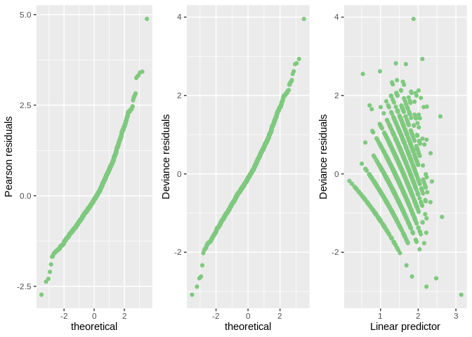

Group\_04
================
Suraj Kumar
17/07/2021

# Introduction

# Exploratory Data Analysis

# Formal Data Analysis

we fit a poisson model as our response is a count variable. We have
excluded Region as a covariate because there was only one factor.

    Call:
    glm(formula = Total.Number.of.Family.members ~ log(Total.Household.Income) + 
        log(Total.Food.Expenditure) + Household.Head.Age + Type.of.Household + 
        sqrt(House.Floor.Area) + House.Age + Number.of.bedrooms + 
        Electricity, family = "poisson", data = data)

    Deviance Residuals: 
        Min       1Q   Median       3Q      Max  
    -3.4578  -0.5900  -0.1078   0.4460   3.3253  

    Coefficients:
                                                              Estimate Std. Error
    (Intercept)                                             -2.9408534  0.2464422
    log(Total.Household.Income)                             -0.1373393  0.0215921
    log(Total.Food.Expenditure)                              0.6012710  0.0286700
    Household.Head.Age                                      -0.0034176  0.0008134
    Type.of.HouseholdSingle Family                          -0.2694626  0.0230167
    Type.of.HouseholdTwo or More Nonrelated Persons/Members -0.0244688  0.1809300
    sqrt(House.Floor.Area)                                  -0.0175685  0.0055736
    House.Age                                               -0.0039392  0.0010306
    Number.of.bedrooms                                       0.0251192  0.0128044
    Electricity                                             -0.1606533  0.0298505
                                                            z value Pr(>|z|)    
    (Intercept)                                             -11.933  < 2e-16 ***
    log(Total.Household.Income)                              -6.361 2.01e-10 ***
    log(Total.Food.Expenditure)                              20.972  < 2e-16 ***
    Household.Head.Age                                       -4.202 2.65e-05 ***
    Type.of.HouseholdSingle Family                          -11.707  < 2e-16 ***
    Type.of.HouseholdTwo or More Nonrelated Persons/Members  -0.135 0.892423    
    sqrt(House.Floor.Area)                                   -3.152 0.001621 ** 
    House.Age                                                -3.822 0.000132 ***
    Number.of.bedrooms                                        1.962 0.049790 *  
    Electricity                                              -5.382 7.37e-08 ***
    ---
    Signif. codes:  0 '***' 0.001 '**' 0.01 '*' 0.05 '.' 0.1 ' ' 1

    (Dispersion parameter for poisson family taken to be 1)

        Null deviance: 2217.8  on 2121  degrees of freedom
    Residual deviance: 1343.1  on 2112  degrees of freedom
    AIC: 8301.1

    Number of Fisher Scoring iterations: 4

<table>
<thead>
<tr>
<th style="text-align:left;">
</th>
<th style="text-align:right;">
2.5 %
</th>
<th style="text-align:right;">
97.5 %
</th>
</tr>
</thead>
<tbody>
<tr>
<td style="text-align:left;">
(Intercept)
</td>
<td style="text-align:right;">
-3.4236821
</td>
<td style="text-align:right;">
-2.4576544
</td>
</tr>
<tr>
<td style="text-align:left;">
log(Total.Household.Income)
</td>
<td style="text-align:right;">
-0.1796516
</td>
<td style="text-align:right;">
-0.0950141
</td>
</tr>
<tr>
<td style="text-align:left;">
log(Total.Food.Expenditure)
</td>
<td style="text-align:right;">
0.5448658
</td>
<td style="text-align:right;">
0.6572414
</td>
</tr>
<tr>
<td style="text-align:left;">
Household.Head.Age
</td>
<td style="text-align:right;">
-0.0050130
</td>
<td style="text-align:right;">
-0.0018246
</td>
</tr>
<tr>
<td style="text-align:left;">
Type.of.HouseholdSingle Family
</td>
<td style="text-align:right;">
-0.3145006
</td>
<td style="text-align:right;">
-0.2242739
</td>
</tr>
<tr>
<td style="text-align:left;">
Type.of.HouseholdTwo or More Nonrelated Persons/Members
</td>
<td style="text-align:right;">
-0.4007295
</td>
<td style="text-align:right;">
0.3109503
</td>
</tr>
<tr>
<td style="text-align:left;">
sqrt(House.Floor.Area)
</td>
<td style="text-align:right;">
-0.0285609
</td>
<td style="text-align:right;">
-0.0067129
</td>
</tr>
<tr>
<td style="text-align:left;">
House.Age
</td>
<td style="text-align:right;">
-0.0059678
</td>
<td style="text-align:right;">
-0.0019280
</td>
</tr>
<tr>
<td style="text-align:left;">
Number.of.bedrooms
</td>
<td style="text-align:right;">
0.0000059
</td>
<td style="text-align:right;">
0.0501979
</td>
</tr>
<tr>
<td style="text-align:left;">
Electricity
</td>
<td style="text-align:right;">
-0.2189236
</td>
<td style="text-align:right;">
-0.1019048
</td>
</tr>
</tbody>
</table>

<!-- -->

# Conclusions

# Extention
